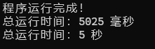
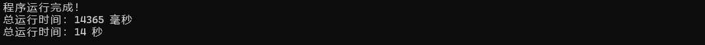
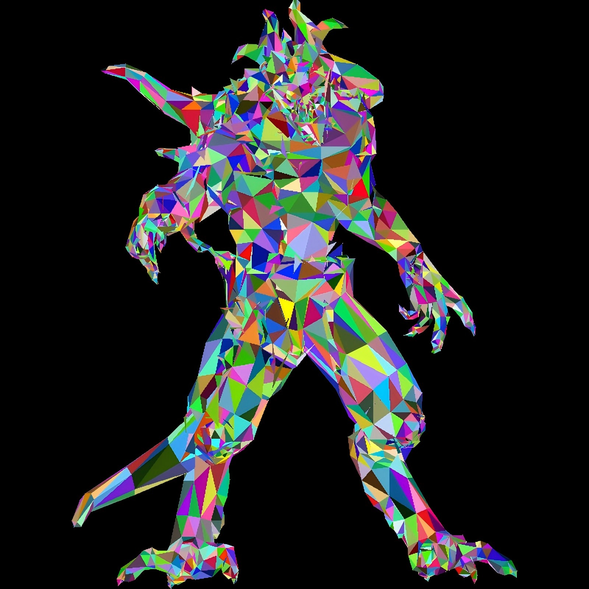

# TinyRenderer个人学习笔记

[Github仓库](https://github.com/MDA21/TinyRendererNote)

这份笔记大致按照的是TinyRenderer的顺序来实现软光栅，但是并没有照搬。笔记主要记录的是自己在实现过程中完成的部分、一些优化思路，不会赘述原项目的内容。鄙人才疏学浅，难免犯错，有问题还请大家指正。


## Bresenham画线

这部分的目标是搓一个能画`.obj`轮廓的程序

教程中提供了`tgaimage.h`和`tgaimage.cpp`，其中包含了对`.tga`格式最基本的处理函数，剩下的都是自己搓。

### 第一次尝试

#### 文件结构

```
tinyrenderer/
├── include/           # 所有头文件目录
│   ├── vector.h
│   ├── model.h
│   └── tgaimage.h
└── src/               # 所有源文件目录
    ├── model.cpp
    ├── tgaimage.cpp
    └── main.cpp

```

#### vector.h

我们需要一种数据结构来存储顶点（vertex）的xyz坐标，由于不能用`Eigen`库，我们自己定义一个简单的结构就行，这就是`vector.h`。

```c++
struct Vec2i
{
	int x, y;
	Vec2i(int x = 0, int y = 0) : x(x), y(y) {}
};

struct Vec3f
{
	float x, y, z;
	Vec3f(float x = 0, float y = 0, float z = 0) : x(x), y(y), z(z) {}
};
```

分别包含一个二维整数向量和一个三维浮点向量的定义。

tips: 标准库里的std::vector是动态数组。

#### model.h

这个头文件包含了Model类的定义和方法，其中`filename`就是文件的路径。

```c++
#include <string>
#include <vector>
#include "vector.h"

class Model
{
public:
	Model(const std::string& filename);		//加载模型
	int nverts() const;		//返回顶点数量
	int nfaces() const;		//返回面数量
	Vec3f vert(const int i) const;		//返回第i个顶点坐标
	Vec3f vert(const int iface, const int nthvert) const;	
	//返回第iface个面第nthvert个顶点坐标
    
private:
	std::vector<Vec3f> verts;
	std::vector<std::vector<int>> faces;
};

void Log(const std::string& message);	
```

#### model.cpp

主要的函数是`Model::Model(const std::string& filename)`，用于加载模型

教程提供了一个[wavefront obj](https://en.wikipedia.org/wiki/Wavefront_.obj_file)文件，我们需要先大致了解一下这种格式，这种格式是纯文本的，可以直接用vscode打开。

一个`.obj`文件通常存储了两大类信息：**数据点** 和 **拓扑结构**

数据点部分通常位于文件的前半部分，定义了模型所有的原材料

```
v 0.11526 0.700717 0.0677257
...

vt  0.067 0.290 0.173
...

vn  0.447 0.893 -0.051
..
```

v - 几何顶点

vt - 纹理坐标

vn - 顶点法线

拓扑部分部分是 f (Face)，它不存储坐标，只存储索引。它告诉计算机：把第几个点、第几个纹理、第几个法线连起来，构成一个面，`f v/vt/vn v/vt/vn  v/vt/vn`。

```
f 680/701/680 679/700/679 684/738/684
```

大多数现代 GPU 只能画三角形，如果你读到了四边形，通常需要在代码里把它拆分成两个三角形。本次提供的暗黑破坏神的模型都是三角形，但是如果去blender直接导出一个立方体的话，你就会发现 f 行每行有四组，不过我在第一次实现中没有管四边形。

剩下的基本上就是标准库的使用了，c with stl这一块。在第一部分的内容中，我们不需要管法线和纹理，也就是说，只需要读取和识别 **v 和 f** ，其余部分可以都丢掉。

需要注意的是，**f 的索引从 1 开始**，所以把面存入动态数组时需要把索引减1。

```c++
#include <string>
#include <iostream>
#include <vector>
#include <fstream>
#include <sstream>
#include "../include/model.h"

void Log(const std::string& message) {
	std::cout << message << std::endl;
}

Model::Model(const std::string& filename) {
	std::ifstream in;
	in.open(filename);

	if (!in.is_open()) {
		Log("Cannot open file: " + filename);
		return;
	}

	std::string line;
	while (!in.eof()) {
		std::getline(in, line);
		std::istringstream iss(line);
		std::string type;
		iss >> type;

		if (type == "v") {
			float x, y, z;
			iss >> x >> y >> z;
			verts.push_back(Vec3f(x, y, z));
		}
		else if (type == "f") {
			//blender的导出格式是 f  v/vt/vn..
			std::vector<int> face_indices;
			int idx;
			char trash; //用来吃掉斜杠

			while (iss >> idx) {
				idx--;
				face_indices.push_back(idx);

				if(iss.peek() == '/') {
					iss >> trash;
					if (iss.peek() != '/') {
						//处理纹理vt
						int vt;
						iss >> vt;
					}

					if (iss.peek() == '/') {
						iss >> trash;
						//处理法线
						int vn;
						iss >> vn;
					}
				}
			}
			faces.push_back(face_indices);
		}
		else continue;
	}
}

int Model::nverts() const {
	return static_cast<int>(verts.size());
}

int Model::nfaces() const {
	return static_cast<int>(faces.size());
}

Vec3f Model::vert(const int i) const {
	return verts[i];
}

Vec3f Model::vert(const int iface, const int nthvert) const {
	return verts[faces[iface][nthvert]];
}


```

#### main.cpp

接下来要用读取到的数据画线了，但是我们仍然会遇到两个问题。

1、我们读取的坐标信息包含了 $$z$$ 轴，但是目前我们只知道设置 $$xy$$ 轴。

在第一章，我们进行的操作实际上是**沿 $$z$$ 轴方向的正交投影**，相当于直接把模型压扁到 $$xOy$$ 面上了。这操作很简单，也就是说我们不用管 $$z$$ 轴了，而且看起来效果还行。

* **公式**：
  $$
  x_{screen} = x_{model} \\
  y_{screen} = y_{model}
  $$

* **物理意义**：把三维物体垂直拍扁在屏幕上。

* **视觉效果**：没有透视（近大远小），只有轮廓。

代价就是信息的丢失，在只画线的时候感觉不明显，但是如果进入填充模式要给三角形上色，就会出现问题。这部分我们会在后面的章节解决。

2、我们使用TGAImage的方法`void set(const int x, const int y, const TGAColor &c)`来设置 $$(x, y)$$ 点的像素颜色，传入的xy需要是整形，但是我们读取到的顶点坐标都是浮点型。而且打开obj文件会发现顶点的坐标都是在 $$[-1, 1]$$ 范围内，如果强行转换成整型，就会都变成 0 。

为了让它们正确显示，我们要把这些坐标对应到屏幕上。

```c++
//假如我初始规定了这样大小的屏幕
constexpr int width  = 800;
constexpr int height = 800;
TGAImage framebuffer(width, height, TGAImage::RGB);
```

要把 $$[-1, 1]$$ 范围内的 $$xy$$ 分别映射到 $$[0, width]$$ 和 $$[0, height]$$，我们需要进行以下操作：

```c++
int screen_x0 = static_cast<int>((v0.x + 1.0f) * width / 2.0f);
int screen_y0 = static_cast<int>((v0.y + 1.0f) * height / 2.0f);
int screen_x1 = static_cast<int>((v1.x + 1.0f) * width / 2.0f);
int screen_y1 = static_cast<int>((v1.y + 1.0f) * height / 2.0f);
```

`.obj` 文件里存储的顶点坐标 $(x, y, z)$，其实是模型空间 (Model Space) 的坐标，也被称为局部空间 (Local Space)。

为了让你彻底理解这意味着什么，以及它在后续课程中的位置，我们可以打个比方。

在 TinyRenderer 的第一章，其实做了一个巨大的简化。

完整的图形学流水线（Pipeline）是这样的：

1.  **模型空间 (Model Space)**：OBJ 文件里的原始数据。
    *   *(现状)*
2.  **世界空间 (World Space)**：你把人偶摆在房间的角落里。
    *   *需要乘以 Model Matrix (模型矩阵)*。
3.  **观察空间 (View Space / Camera Space)**：以摄像机为中心看这个世界。
    *   *需要乘以 View Matrix (视图矩阵)*。
4.  **裁剪空间 (Clip Space) / 归一化设备坐标 (NDC)**：把视野内的东西压缩到 $[-1, 1]$ 的立方体里。
    *   *需要乘以 Projection Matrix (投影矩阵)*。
5.  **屏幕空间 (Screen Space)**：把 $[-1, 1]$ 映射到像素坐标 $[0, 800]$。
    *   *(刚才写的 `(x+1)*width/2` 就是这一步)*

**现在的做法实际上是：**
假设模型就放在世界中心 $(0,0,0)$，摄像机正对着它，没有任何旋转或位移。
所以**跳过了中间所有的矩阵变换**，直接把**模型空间**强行当成了**NDC**（$[-1, 1]$ 范围），然后一步转换到了**屏幕空间**。

```c++
#include <string>
#include <iostream>
#include <vector>
#include <fstream>
#include <sstream>
#include "../include/model.h"
#include "../include/tgaimage.h"

constexpr TGAColor white   = {255, 255, 255, 255}; // attention, BGRA order
constexpr TGAColor green   = {  0, 255,   0, 255};
constexpr TGAColor red     = {  0,   0, 255, 255};
constexpr TGAColor blue    = {255, 128,  64, 255};
constexpr TGAColor yellow  = {  0, 200, 255, 255};

void draw_line(int x0, int y0, int x1, int y1, TGAImage& framebuffer, TGAColor color) {
	//画线段的Bresenham算法实现
	bool steep = false;
	steep = (std::abs(x0 - x1) < std::abs(y0 - y1));
	if (steep) {
		std::swap(x0, y0);
		std::swap(x1, y1);
	}
	if(x0 > x1) {
		std::swap(x0, x1);
		std::swap(y0, y1);
	}
	for (int x = x0; x <= x1; x++) {
		float t = (x - x0) / static_cast<float>(x1 - x0);
		int y = std::round(y0 + (y1 - y0) * t);

		if (steep) {
			framebuffer.set(y, x, color);
		} else {
			framebuffer.set(x, y, color);
		}
	}
}

int main(int argc, char** argv) {
    constexpr int width  = 800;
    constexpr int height = 800;
    TGAImage framebuffer(width, height, TGAImage::RGB);

	//这里可以改成从命令行参数传入模型路径
    Model model("F:/VSproject/TinyRenderer/obj/diablo3_pose/diablo3_pose.obj");

	int num_faces = model.nfaces();

	for (int i = 0; i < num_faces; i++) {
        for (int j = 0; j < 3; j++) {
			Vec3f v0 = model.vert(i, j);
			Vec3f v1 = model.vert(i, (j + 1) % 3);
			int screen_x0 = static_cast<int>((v0.x + 1.0f) * width / 2.0f);
			int screen_y0 = static_cast<int>((v0.y + 1.0f) * height / 2.0f);
			int screen_x1 = static_cast<int>((v1.x + 1.0f) * width / 2.0f);
			int screen_y1 = static_cast<int>((v1.y + 1.0f) * height / 2.0f);
			draw_line(screen_x0, screen_y0, screen_x1, screen_y1, framebuffer, red);
        }
	}
    
    framebuffer.write_tga_file("framebuffer.tga");
    return 0;
}

```

### 结果与复盘

#### 结果

我们会得到以下图片：

#### 复盘

我们引入`chrono`库进行记时，并且让核心的画线部分循环1000次。由于解析 OBJ 是文件 IO 操作，耗时且解析后的数据不会变，重复解析只会让计时结果失真，所以不放进循环。

```c++
int main(int argc, char** argv) {
	

    constexpr int width  = 800;
    constexpr int height = 800;
	const int LOOP_TIMES = 1000;
    TGAImage framebuffer(width, height, TGAImage::RGB);

	//这里后续可以改成从命令行参数传入模型路径
    Model model("F:/VSproject/TinyRenderer/obj/diablo3_pose/diablo3_pose.obj");

	int num_faces = model.nfaces();
	int num_verts = model.nverts();
	auto start_time = std::chrono::steady_clock::now();
	for (int k = 0; k < LOOP_TIMES; k++) {
		for (int i = 0; i < num_faces; i++) {
			for (int j = 0; j < 3; j++) {
				Vec3f v0 = model.vert(i, j);
				Vec3f v1 = model.vert(i, (j + 1) % 3);
				int screen_x0 = project(v0.x, width);
				int screen_y0 = project(v0.y, height);
				int screen_x1 = project(v1.x, width);
				int screen_y1 = project(v1.y, height);
				draw_line(screen_x0, screen_y0, screen_x1, screen_y1, framebuffer, red);
			}
		}
	}
    
    framebuffer.write_tga_file("framebuffer.tga");

	auto end_time = std::chrono::steady_clock::now();
	auto duration_ms = std::chrono::duration_cast<std::chrono::milliseconds>(end_time - start_time).count();
	auto duration_s = std::chrono::duration_cast<std::chrono::seconds>(end_time - start_time).count();
	std::cout << "程序运行完成！" << std::endl;
	std::cout << "总运行时间：" << duration_ms << " 毫秒" << std::endl;
	std::cout << "总运行时间：" << duration_s << " 秒" << std::endl;

    return 0;
}
```

结果：



其实很明显我们在main.cpp中有至少三个可以优化的点

### 第二次尝试

1、我的Bresenham算法实现并不是最标准的，它包含了两个性能瓶颈

```c++
float t = (x - x0) / static_cast<float>(x1 - x0); // 浮点除法！最慢的操作
int y = std::round(y0 + (y1 - y0) * t);           // 浮点加法、乘法、取整
```

其实我们不需要算出具体的 y 是多少，我们只需要知道：**每当 x 移动一步，y 到底该不该动一步？**这通过一个误差变量 `error` 来累计 

```c++
void draw_line(int x0, int y0, int x1, int y1, TGAImage& framebuffer, TGAColor color) {
	//画线段的Bresenham算法实现
	bool steep = false;
	steep = (std::abs(x0 - x1) < std::abs(y0 - y1));
	if (steep) {
		std::swap(x0, y0);
		std::swap(x1, y1);
	}
	if(x0 > x1) {
		std::swap(x0, x1);
		std::swap(y0, y1);
	}

	int dx = x1 - x0;
	int dy = std::abs(y1 - y0);
	int error = 0;
	int ystep = (y0 < y1) ? 1 : -1;
	int y = y0;
	
	for (int x = x0; x <= x1; x++) {
		if (steep) {
			framebuffer.set(y, x, color);
		} else {
			framebuffer.set(x, y, color);
		}
        
        // 原本的斜率是 dy/dx。如果不动用除法，我们就在 error 里累加 dy
        // 当 error 攒够了一个 dx 时，说明 y 该走一步了

		error += dy;
        
		// 这里实际上是把 error 扩大了 dx 倍来比较，避免除法
        // error >= 0.5 (即 error * 2 >= dx)
		if (error * 2 >= dx) {
			y += ystep;
			error -= dx;// 误差清零（减去一个单位）
		}
	}
}
```

再次运行，可以看到，确实变快了一些


### 第三次尝试

2、三角形重复边。一个封闭的 3D 模型，绝大多数边都是两个三角形共用的，所以需要一个“记账本”，记录哪条边已经画过了。如果遇到画过的，就跳过,本质上是那内存换时间，没有免费的午餐。

tips: 在实时渲染中，**重复绘制** 确实是一个性能杀手。虽然在现在的 GPU 硬件管线中，线框模式通常直接由驱动处理，但在软渲染器中，每一行代码的效率都至关重要。

3、几何计算浪费。同一个顶点被好几个三角形共用，原来的算法会执行好几次投影（就是把它放大到屏幕那一步）。

把这两个浪费放到一起是因为它们都属于重复劳动。那么我们现在来梳理一下思路：

整个渲染过程被拆分成了三个清晰的阶段：

#### 阶段 1：拓扑预处理 (Topology Pre-processing)
*   **位置**：主循环外部（只执行 1 次）。
*   **任务**：搞清楚“到底有多少条唯一的边”。
*   **逻辑**：
    1.  遍历所有面，把 `(u, v)` 和 `(v, u)` 统一格式化为 `(min, max)`。
    2.  全部扔进一个 `vector`。
    3.  **Sort（排序）**：把相同的边排在一起。
    4.  **Unique（去重）**：剔除重复的边。

```c++
#include <cmath>
#include <algorithm>
//......

struct Edge {
	int u, v;
	//重载 < 运算符，用于 sort
	bool operator<(const Edge& other) const {
		if (u != other.u) return u < other.u;
		return v < other.v;
	}
	//重载 == 运算符，用于判断重复
	bool operator==(const Edge& other) const {
		return u == other.u && v == other.v;
	}
};

void draw_line(int x0, int y0, int x1, int y1, TGAImage& framebuffer, TGAColor color) {
    //......
}

//把投影到屏幕的部分单独拿出来的一个函数
//worh: width or height
int project(float pos, int worh) {
	int screen_pos = static_cast<int>((pos + 1.0f) * worh / 2.0f);
	return screen_pos;
}

int main(int argc, char** argv) {
    //......
    int num_faces = model.nfaces();
	int num_verts = model.nverts();
	std::vector<Edge> unique_edges;
	unique_edges.reserve(num_faces * 3);
	auto start_time = std::chrono::steady_clock::now();

	for(int i = 0; i < num_faces; i++) {
		for(int j = 0; j < 3; j++) {
			int v0_idx = model.vert_idx(i, j % 3);
			int v1_idx = model.vert_idx(i, (j + 1) % 3);
			if(v0_idx > v1_idx) std::swap(v0_idx, v1_idx);
			Edge edge = {v0_idx, v1_idx};
			unique_edges.push_back(edge);
		}
	}
    
    std::sort(unique_edges.begin(), unique_edges.end());
	auto last = std::unique(unique_edges.begin(), unique_edges.end());
	unique_edges.erase(last, unique_edges.end());

	std::cout << "Original edges: " << model.nfaces() * 3 << std::endl;
    std::cout << "Unique edges:   " << unique_edges.size() << std::endl;
    //......
}


```


#### 阶段 2：顶点着色 (Vertex Processing)
*   **位置**：渲染循环内部（每一帧执行）。
*   **任务**：计算所有顶点在屏幕上的位置。
*   **逻辑**：
    1.  创建一个大小为 `num_verts` 的数组 `screen_coords`。
    2.  遍历 `0` 到 `num_verts`。
    3.  对每个点做 `project`，结果存入数组。
*   **关键点**：这里用的是 `num_verts` 循环，**每个顶点只计算一次**，绝无浪费。 

```c++
std::vector<Vec2i> screen_coords(num_verts);


for (int k = 0; k < LOOP_TIMES; k++) {
	for (int i = 0; i < num_verts; i++) {
		Vec3f v = model.vert(i);
		screen_coords[i].x = project(v.x, width);
		screen_coords[i].y = project(v.y, height);
	}


	for (const auto& edge : unique_edges) {

		
		Vec2i p0 = screen_coords[edge.u];
		Vec2i p1 = screen_coords[edge.v];

		//这里其实可以添加一个裁剪检查
		//if (p0.x < 0 || p0.x >= width || p0.y < 0 ...) continue;

		draw_line(p0.x, p0.y, p1.x, p1.y, framebuffer, red);
	}
}
```


#### 阶段 3：光栅化 (Rasterization / Drawing)
*   **位置**：渲染循环内部（每一帧执行）。
*   **任务**：连线。
*   **逻辑**：
    1.  遍历那份“去重后的边列表” (`unique_edges`)。
    2.  根据索引 `u` 和 `v`，直接去 `screen_coords` 数组里查表拿坐标。
    3.  调用 `draw_line`。
*   **关键点**：只画必须画的线，没有重复劳动。

假设我们有的diablo模型是一个标准的封闭 3D 模型。
根据欧拉示性数和图形学统计规律，对于封闭三角网格：

*   **顶点数 (V)**
*   **面数 (F)** $\approx 2V$
*   **边数 (E)** $\approx 3V$

我们来看看优化前后的运算量对比：

#### 1. 投影计算 (Projection Math)
这是浮点运算，比较耗时。

*   **优化前（按面遍历）**：
    *   逻辑：`for i in faces: for j in 0..2: project(vert)`
    *   次数：$3 \times F \approx 3 \times 2V = \mathbf{6V}$ 次
*   **优化后（按点遍历）**：
    *   逻辑：`for i in verts: project(vert)`
    *   次数：$1 \times V = \mathbf{1V}$ 次
*   **结论**：**投影计算量减少了 6 倍！**（因为平均每个顶点被 6 个三角形共用）。

#### 2. 画线操作 (Draw Call)
这是整数运算和内存写入，也非常耗时。

*   **优化前（按面画线）**：
    *   逻辑：每个三角形画 3 条边。
    *   次数：$3 \times F \approx 6V$ 条线。
    *   *注：因为每条边是两个面共用的，所以每条边被画了 2 次。*
*   **优化后（按唯一边画线）**：
    *   逻辑：只画 `unique_edges`。
    *   次数：$1 \times E \approx \mathbf{3V}$ 条线。
*   **结论**：**画线次数减少了 2 倍！**

#### 最后速度

我的电脑的cpu是i7-12650，不同电脑运行速度不同，但明显比前面的快得多。

最后别忘了删掉测试用的循环。

### 最终的main.cpp

```c++
#include <string>
#include <iostream>
#include <vector>
#include <fstream>
#include <chrono>
#include <sstream>
#include <cmath>
#include <algorithm>
#include "../include/model.h"
#include "../include/tgaimage.h"

constexpr TGAColor white   = {255, 255, 255, 255}; // attention, BGRA order
constexpr TGAColor green   = {  0, 255,   0, 255};
constexpr TGAColor red     = {  0,   0, 255, 255};
constexpr TGAColor blue    = {255, 128,  64, 255};
constexpr TGAColor yellow  = {  0, 200, 255, 255};

struct Edge {
	int u, v;
	//重载 < 运算符，用于 sort
	bool operator<(const Edge& other) const {
		if (u != other.u) return u < other.u;
		return v < other.v;
	}
	//重载 == 运算符，用于判断重复
	bool operator==(const Edge& other) const {
		return u == other.u && v == other.v;
	}
};

void draw_line(int x0, int y0, int x1, int y1, TGAImage& framebuffer, TGAColor color) {
	//画线段的Bresenham算法实现
	bool steep = false;
	steep = (std::abs(x0 - x1) < std::abs(y0 - y1));
	if (steep) {
		std::swap(x0, y0);
		std::swap(x1, y1);
	}
	if(x0 > x1) {
		std::swap(x0, x1);
		std::swap(y0, y1);
	}

	int dx = x1 - x0;
	int dy = std::abs(y1 - y0);
	int error = 0;
	int ystep = (y0 < y1) ? 1 : -1;
	int y = y0;

	for (int x = x0; x <= x1; x++) {
		if (steep) {
			framebuffer.set(y, x, color);
		} else {
			framebuffer.set(x, y, color);
		}

		error += dy;

		if (error * 2 >= dx) {
			y += ystep;
			error -= dx;
		}
	}
}

//worh: width or height
int project(float pos, int worh) {
	int screen_pos = static_cast<int>((pos + 1.0f) * worh / 2.0f);
	return screen_pos;
}
int main(int argc, char** argv) {
	

    constexpr int width  = 800;
    constexpr int height = 800;
    TGAImage framebuffer(width, height, TGAImage::RGB);

	//这里后续可以改成从命令行参数传入模型路径
    Model model("F:/VSproject/TinyRenderer/obj/diablo3_pose/diablo3_pose.obj");

	int num_faces = model.nfaces();
	int num_verts = model.nverts();
	std::vector<Edge> unique_edges;
	unique_edges.reserve(num_faces * 3);
	auto start_time = std::chrono::steady_clock::now();

	for(int i = 0; i < num_faces; i++) {
		for(int j = 0; j < 3; j++) {
			int v0_idx = model.vert_idx(i, j % 3);
			int v1_idx = model.vert_idx(i, (j + 1) % 3);
			if(v0_idx > v1_idx) std::swap(v0_idx, v1_idx);
			Edge edge = {v0_idx, v1_idx};
			unique_edges.push_back(edge);
		}
	}

	std::sort(unique_edges.begin(), unique_edges.end());
	auto last = std::unique(unique_edges.begin(), unique_edges.end());
	unique_edges.erase(last, unique_edges.end());

	std::cout << "Original edges: " << model.nfaces() * 3 << std::endl;
	std::cout << "Unique edges:   " << unique_edges.size() << std::endl;

	std::vector<Vec2i> screen_coords(num_verts);
	


	for (int i = 0; i < num_verts; i++) {
		Vec3f v = model.vert(i);
		screen_coords[i].x = project(v.x, width);
		screen_coords[i].y = project(v.y, height);
	}


	for (const auto& edge : unique_edges) {

			
		Vec2i p0 = screen_coords[edge.u];
		Vec2i p1 = screen_coords[edge.v];

		// 简单的裁剪检查（可选，防止画出界崩溃）
		// if (p0.x < 0 || p0.x >= width || p0.y < 0 ...) continue;

		draw_line(p0.x, p0.y, p1.x, p1.y, framebuffer, red);
	}
	
    
    framebuffer.write_tga_file("framebuffer.tga");

	auto end_time = std::chrono::steady_clock::now();
	auto duration_ms = std::chrono::duration_cast<std::chrono::milliseconds>(end_time - start_time).count();
	auto duration_s = std::chrono::duration_cast<std::chrono::seconds>(end_time - start_time).count();
	std::cout << "程序运行完成！" << std::endl;
	std::cout << "总运行时间：" << duration_ms << " 毫秒" << std::endl;
	std::cout << "总运行时间：" << duration_s << " 秒" << std::endl;

    return 0;
}

```


## Triangle Rasterization

简单来说，本节目标是在屏幕上填充三角形线框。

**逐行扫描渲染在此不作赘述，我们把目光放到包围盒的构造和判断点在三角形内外的方法。**


### 包围盒（Bounding Box）

如果我们运行初始提交，会得到下图：


现在我们要来填充这几个线框，很显然，我们需要判断哪些点是在三角形内部。但是如果扫描整个屏幕，会造成很大的浪费，因为这张图里大部分都是黑色。那么我们可不可以先大致确定一下三角形的范围，然后再判断点是否在三角形内内部呢？从这里引入 **包围盒** 。

#### AABB（Axis-Aligned Bounding Box 轴对齐包围盒）

这是 tinyrenderer 中实现的方式。顾名思义，轴对齐包围盒就是确定出一个矩形，矩形的两条边与xy坐标轴分别平行，画出来长这样：


实现方式也很简单

```c++
double signed_triangle_area(int ax, int ay, int bx, int by, int cx, int cy) {
	return .5 * ((by - ay) * (bx + ax) + (cy - by) * (cx + bx) + (ay - cy) * (ax + cx));
}

void triangle(int ax, int ay, int bx, int by, int cx, int cy, TGAImage& framebuffer, TGAColor color) {
	int bboxmin_x = std::min({ ax, bx, cx });
	int bboxmax_x = std::max({ ax, bx, cx });
	int bboxmin_y = std::min({ ay, by, cy });
	int bboxmax_y = std::max({ ay, by, cy });
	double total_area = signed_triangle_area(ax, ay, bx, by, cx, cy);
	if (total_area < 1)return;

	for(int x = bboxmax_x; x >= bboxmin_x; x--) {
		for(int y = bboxmax_y; y >= bboxmin_y; y--) {
			double alpha = signed_triangle_area(x, y, bx, by, cx, cy) / total_area;
			if (alpha < 0)continue;

			double beta = signed_triangle_area(ax, ay, x, y, cx, cy) / total_area;
			if (beta < 0)continue;

			double gamma = signed_triangle_area(ax, ay, bx, by, x, y) / total_area;
			if (gamma < 0)continue;

			framebuffer.set(x, y, color);
            //这里的输出结果是三角形，而不是包围盒，要得到上图的包围盒的话，直接set不需要判断
			
		}
	}
}
```

确实需要判断的点变少了，但是这种包围盒会有一个问题。请看白色的这个**狭长**的三角形，虽然它的面积不大，但是会生成一个很大的AABB，因此我们有别的种类的包围盒可以解决这个问题。

```c++
for (int i = 0; i < LOOP_TIMES; i++) {

	for (int i = 0; i < model.nfaces(); i++) {
		Vec3f v0 = model.vert(model.vert_idx(i, 0));
		Vec3f v1 = model.vert(model.vert_idx(i, 1));
		Vec3f v2 = model.vert(model.vert_idx(i, 2));
		int ax = project(v0.x, width);
		int ay = project(v0.y, height);
		int bx = project(v1.x, width);
		int by = project(v1.y, height);
		int cx = project(v2.x, width);
		int cy = project(v2.y, height);
		TGAColor rnd;

		for (int c = 0; c < 3; c++) rnd[c] = std::rand() % 255;

		triangle(ax, ay, bx, by, cx, cy, framebuffer, rnd);
	}
}
```

在继续之前，我们先记录一下用 **AABB + 重心坐标** 循环1000次所需的时间，用diablo模型




#### OBB (Oriented Bounding Box 方向包围盒)

OBB通常用于**对精度有要求，且物体会发生旋转的长条形或扁平物体**，因此在软光栅中用了可能会更慢（至少我尝试的方法是这样），但还是和大家分享一下我的思路。

OBB（Oriented Bounding Box）是**可以任意旋转的矩形（2D）/ 长方体（3D）**，其边不强制与坐标轴对齐，而是与被包围物体的 “主轴” 对齐，因此能更紧凑地贴合物体形状，大幅减少无效像素。

OBB有三大核心要素：

**几何中心**：OBB 的中心点（像素坐标，整数），是包围盒的 “锚点”，由三角形顶点的平均坐标计算而来

**正交轴向**：2 个**正交（垂直）+ 单位长度**的向量，定义 OBB 的朝向（比如沿三角形最长边的方向）；2D 场景只需 2 个轴向，且必须垂直。

**半长（半尺寸）**：每个轴向的 “半长度”（整数，像素数），即从中心到该轴向对应边的距离。


接下来我讲的是我构造的简化的2D OBB。 [在这个commit中](https://github.com/MDA21/TinyRendererNote/tree/feature/add-obb-but-slower)，可以找到所有代码，不进行完整的复制粘贴。

我最后使用的是 **主成分分析（PCA）**法来计算obb，可以阅读[这篇文章](https://www.zhihu.com/question/455777411/answer/1878523463)来得知大致思路。

[这篇文章](https://zhuanlan.zhihu.com/p/1973853629871063507)提供了奇异值分解（SVD）的严谨推导，我在搓线性代数库的时候有参考

**我去`vector.h`中重载了基本的运算符，实现了加减乘除、点乘、叉乘、取模、归一化，添加了二维浮点矩阵，以及相关运算，求特征值等**

由于目前我们暂时不考虑深度，所以我构造了一个二维的简化的`OBB2D.h`，具体的实现可以去仓库看：

```c++
#pragma once

#include <vector>
#include "../include/vector.h"
#include <algorithm>

struct OBB2D {
    Vec2f center;          // OBB包围盒中心坐标
	Vec2f axes[2];         // OBB的两个正交轴
    float halfExtents[2];  // 半长/半宽
	
    // 构造默认的包围盒
    OBB2D();

    // 根据提供参数构造包围盒
	OBB2D(const Vec2f& center, float width, float height, float rotationRad);
	
    // 根据提供的点构造包围盒
	OBB2D(const std::vector<Vec2f>& points);
	
    // 返回包围盒的四个顶点
	std::vector<Vec2f> getCorners() const;
	
    // 判断点是否在盒内
	bool containsPoint(const Vec2f& point) const;
	
    // 判断包围盒是否相交
	bool Intersects(const OBB2D& other) const;
	
    // 移动包围盒
	void MoveTo(const Vec2f& newCenter);
	
    // 旋转包围盒
	void Rotate(float angleRad);
};
```

我把它用在了 `triangle`函数中：

```c++
void triangle(int ax, int ay, int bx, int by, int cx, int cy, TGAImage& framebuffer, TGAColor color) {
	
	int bboxmin_x = std::min({ ax, bx, cx });
	int bboxmax_x = std::max({ ax, bx, cx });
	int bboxmin_y = std::min({ ay, by, cy });
	int bboxmax_y = std::max({ ay, by, cy });
	double total_area = signed_triangle_area(ax, ay, bx, by, cx, cy);
	if (total_area < 1)return;


	// 策略：只有当 AABB 的面积远大于三角形面积时，才值得花算力去构建 OBB
	// 否则，构建 OBB 的开销比直接算重心坐标还要大
	double aabb_area = (bboxmax_x - bboxmin_x) * (bboxmax_y - bboxmin_y);

	bool use_obb_culling = false;

	OBB2D triOBB;

	//如果 AABB 面积是三角形的 3 倍以上，说明三角形很细长/倾斜，启用 OBB 剔除
	if ((aabb_area / total_area) > 3.0) {
		std::vector<Vec2f> pts;
		pts.reserve(3);
		pts.emplace_back((float)ax, (float)ay);
		pts.emplace_back((float)bx, (float)by);
		pts.emplace_back((float)cx, (float)cy);

		// 构建 OBB
		triOBB = OBB2D(pts);

		// 为了防止浮点误差导致边缘像素丢失，稍微扩大一点 OBB
		// 这是一个工程技巧，给半长增加 0.5 - 1.0 的容差
		triOBB.halfExtents[0] += 0.5f;
		triOBB.halfExtents[1] += 0.5f;

		use_obb_culling = true;
	}
#pragma omp parallel for
	for(int x = bboxmax_x; x >= bboxmin_x; x--) {
		for(int y = bboxmax_y; y >= bboxmin_y; y--) {

			if (use_obb_culling) {
				// 使用像素中心点 (x + 0.5, y + 0.5) 进行测试精度更高
				Vec2f pixelCenter((float)x + 0.5f, (float)y + 0.5f);

				if (!triOBB.containsPoint(pixelCenter)) {
					continue;
				}
			}

			double alpha = signed_triangle_area(x, y, bx, by, cx, cy) / total_area;
			if (alpha < 0)continue;

			double beta = signed_triangle_area(ax, ay, x, y, cx, cy) / total_area;
			if (beta < 0)continue;

			double gamma = signed_triangle_area(ax, ay, bx, by, x, y) / total_area;
			if (gamma < 0)continue;

			framebuffer.set(x, y, color);
			
		}
	}
}
```

最后的结果是33秒，虽然不尽人意，但是也算顺便复习了线代 ^ ^


### 判断点在三角形内外

#### 重心坐标法

对于三角形ABC

任意点可表示为：

$$P=uA+vB+wC,u+v+w=1$$

**内外判定**：

$$u≥0, v≥0, w≥0$$

$$u、v、w $$可由**有向面积比**求得（与边函数等价）：

$$u =\tfrac{S_{PBC}} {S_{ABC}}$$，$$u =\tfrac{S_{PAC}} {S_{ABC}}$$，$$u =\tfrac{S_{ABP}} {S_{ABC}}$$

**优势**

1. **不只判内外，更用于插值**：纹理坐标、顶点色、法线、雾系数等等
2. 几何意义清晰，数学严谨
3. 与边函数法**数学等价**，只是表现形式不同

**缺点**

需要除法（浮点），**纯为了判点内外反而更重**，不如边函数高效。

aabb+重心坐标：


#### 边函数法

对于三角形ABC，定义三条有向边函数：
$$
e_1(P)=(B_x-A_x)(P_y-A_y)-(B_y-A_y)(P_x-A_x)，即 AB\times AP\\
e_2(P)=(C_x-B_x)(P_y-B_y)-(C_y-B_y)(P_x-B_x)，即BC\times BP\\
e_3(P)=(A_x-C_x)(P_y-C_y)-(A_y-C_y)(P_x-C_x)，即CA\times CP\\
\
$$
**判断规则**

三角形为 **逆时针环绕**：$$e_1≥0, e_2≥0, e_3≥0$$

顺时针则全部 ≤ 0

（实际硬件会统一环绕方向）

**优势**

1. **无除法、无开方**：纯加减乘，可定点 / 整数运算
2. **并行友好、逐像素独立计算**：完美适配 GPU 流处理器
3. **可直接推导重心坐标**：顺便得到纹理 / 颜色 / 法线插值权重
4. **天然支持 subpixel 采样、反走样**
5. 易实现 **top-left rule**（避免边重复绘制 / 漏画）

**缺点**

依赖顶点环绕顺序，边界需额外规则处理。


边函数法和重心坐标在数学上**完全等价**，**边函数的数值 = 对应子三角形的 2 x 有向面积**（毕竟是叉乘嘛），重心坐标的本质是子三角形面积/原三角形总面积，两者的转换只需要通过面积比来实现。

由于我们目前的软光栅只需要判内外，所以可以不要昂贵的浮点除法，改用边函数法来判断。

但是如果直接对每个像素都完整算叉乘，会产生大量乘法、加法，这反而会变得更慢，因此我参考了现代GPU光栅化器使用的**增量计算**的方法。这种方法通常被称为 **Pineda 算法 (Edge Function Method)** 的增量实现。

##### 数学原理

三角形的三条边其实就是三条直线。对于直线 $Ax + By + C = 0$，我们可以定义一个边函数 $E(x, y) = Ax + By + C$。

- 如果 $E(x, y) > 0$，点在直线某一侧。
- 如果 $E(x, y) < 0$，点在另一侧。
- 如果 $E(x, y) = 0$，点在直线上。

如果一个点 $(x, y)$ 同时满足三条边的 $E > 0$（取决于绕序），那么这个点就在三角形内部。

##### 关于“增量”

基于线性函数的性质。
假设我们在 $(x, y)$ 处计算出了 $E(x, y)$。当我们向右移动一个像素到 $(x+1, y)$ 时：
$$
\begin{aligned}
E(x+1, y) &= A(x+1) + By + C \\
&= (Ax + By + C) + A \\
&= E(x, y) + A
\end{aligned}
$$

**这意味着：**
只要你知道了起点的 $E$ 值，计算下一个像素的 $E$ 值**只需要做一次加法**（加上系数 $A$）。同理，换行时（$y+1$），只需要加上系数 $B$。

那么我们来看代码实现：（以下修改都在main.cpp中）

```c++
struct EdgeFunc {
	int a, b, c;       // E = a*x + b*y + c
	int step_x;        // x+1时，E += step_x (即a)
	int step_y;        // y+1时，E += step_y (即b)
};

void precompute_edge_funcs(Vec2i A, Vec2i B, Vec2i C,
	EdgeFunc& e1, EdgeFunc& e2, EdgeFunc& e3) {

	// 边1: A->B
	e1.a = A.y - B.y;
	e1.b = B.x - A.x;
	e1.c = B.y * A.x - B.x * A.y; // 这种形式等价于原来的叉乘形式
	e1.step_x = e1.a;
	e1.step_y = e1.b;

	// 边2: B->C
	e2.a = B.y - C.y;
	e2.b = C.x - B.x;
	e2.c = C.y * B.x - C.x * B.y;
	e2.step_x = e2.a;
	e2.step_y = e2.b;

	// 边3: C->A
	e3.a = C.y - A.y;
	e3.b = A.x - C.x;
	e3.c = A.y * C.x - A.x * C.y;
	e3.step_x = e3.a;
	e3.step_y = e3.b;
}

double signed_triangle_area(int ax, int ay, int bx, int by, int cx, int cy) {
	return .5 * ((by - ay) * (bx + ax) + (cy - by) * (cx + bx) + (ay - cy) * (ax + cx));
}

void triangle(int ax, int ay, int bx, int by, int cx, int cy, TGAImage& framebuffer, TGAColor color) {
	double total_area = signed_triangle_area(ax, ay, bx, by, cx, cy);
	if (total_area < 1)return;
	
	Vec2i A(ax, ay);
	Vec2i B(bx, by);
	Vec2i C(cx, cy);
	EdgeFunc e1, e2, e3;
	precompute_edge_funcs(A, B, C, e1, e2, e3);
	
	int min_x = std::min({ ax, bx, cx });
	int max_x = std::max({ ax, bx, cx });
	int min_y = std::min({ ay, by, cy });
	int max_y = std::max({ ay, by, cy });
	
    
    // 屏幕裁剪 
	min_x = std::max(0, min_x);
	max_x = std::min(framebuffer.width() - 1, max_x);
	min_y = std::max(0, min_y);
	max_y = std::min(framebuffer.height() - 1, max_y);

	if (max_x < min_x || max_y < min_y) return;
	
	
#pragma omp parallel for
	for(int y = min_y; y <= max_y; y++) {
		
        // 计算当前行开始处 (min_x, y) 的边函数值
        // E(x, y) = a*x + b*y + c
		int row_E1 = e1.a * min_x + e1.b * y + e1.c;
		int row_E2 = e2.a * min_x + e2.b * y + e2.c;
		int row_E3 = e3.a * min_x + e3.b * y + e3.c;

		for(int x = min_x; x <= max_x; x++) {
			if ((row_E1 | row_E2 | row_E3) >= 0) {
				framebuffer.set(x, y, color);
			}
            
            // x 前进 1 步，边函数值增加 step_x (即 a)
			row_E1 += e1.step_x;
			row_E2 += e2.step_x;
			row_E3 += e3.step_x;
			
		}
	}
}
```

最后结果：




哦耶~直接快了一半。^ ^


#### 思考

其实上面提到，边函数法和重心坐标在数学上是等价的，边函数是线性变化的，重心坐标就是多除以了个总面积，所以重心坐标实际上应该也是线性变化的。**完全可以对重心坐标使用增量法。**因此一下子快了这么多其实不一定是把除法优化掉带来的，更可能是增量法的效果。

不过很显然我更喜欢边函数法，先通过测试，再谈插值颜色、深度、UV……

而且理论上来说可以更快，把目前我的这个循环是缓存友好的，如果想进一步压榨，可以尝试把`triangle`函数里的计算逻辑改成SIMD版本。现在想到加载模型的时候其实就可以这么改了：

```c++
//原有的存储模型顶点的大概逻辑
struct Vec3f { float x, y, z; };
vector<Vec3f> vertices; 
```

可以改成：

```c++
struct Vertices {
    vector<float> xs;
    vector<float> ys;
    vector<float> zs;
};
```

同理可以把`triangle`函数里面的计算逻辑改成类似的试试看，拿内存换速度这一块，不过现在绘制一帧大概只需要0.006秒，就先不优化了喵。
