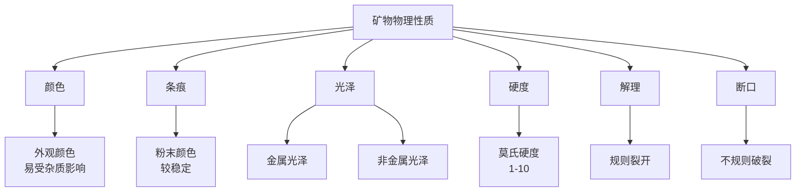
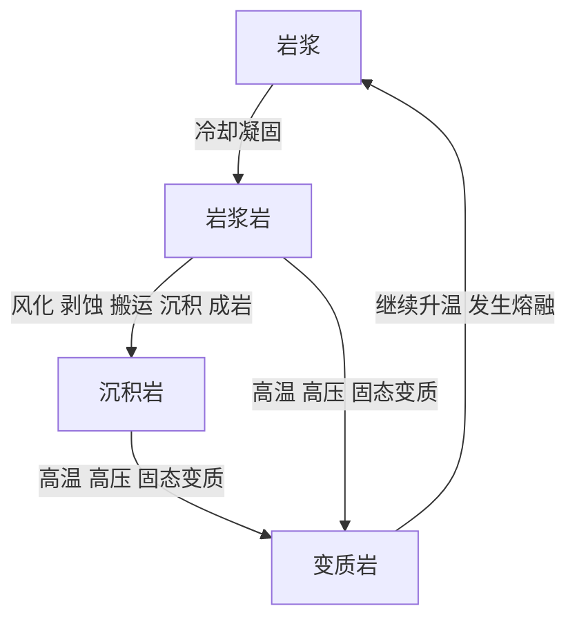

## 工程地质期末考试问题/知识点整理

整理于2026.1.15

zs老师几乎把整本书都画了重点，而历年卷也是考的很散，为了全面覆盖，这份文档会很长。

## 第一章 绪论

### 什么是工程地质学？工程地质学的概念？

工程地质学是介于地学和工程学之间的一门边缘交叉学科，它研究土木工程中的地址问题，也就是在工程建筑设计、施工和运营的实施过程中合理地处理和正确地使用自然地质条件改造不良地质条件等地质问题。

工程地质学是为了解决地质条件于人类工程活动的之间矛盾的一门实用性很强的学科。

## 第二章 岩石的成因类型及其工程地质特征

### 矿物与岩石的基本概念

存在于地壳中的具有一定化学成分和物理性质的自然元素或化合物，称为矿物，其中构成岩石的矿物称为造岩矿物。

组成地壳的岩石都是在一定的地质条件下，由一种或几种矿物自然组合而成的矿物集合体。

### 列举矿物的六种的物理性质

### 解理与断口的区别 P8

| 对比点         | 解理                 | 断口             |
| -------------- | -------------------- | ---------------- |
| 是否有固定方向 | 有（与晶体结构有关） | 无固定方向       |
| 破裂面是否规则 | 平整、光滑           | 粗糙、不平整     |
| 是否可重复出现 | 可多次沿同一方向裂开 | 每次形态可能不同 |
| 与晶体结构关系 | **直接反映内部晶格** | 与晶格关系弱     |
| 野外鉴别价值   | 很高                 | 辅助性质         |
| 典型例子       | 云母、方解石、长石   | 石英、燧石       |

矿物解理的完全程度和断口是互相消长的，解理完全时则不显断口。反之，解理不完全或无解理时，则断口显著。

### 三大岩石的相互转化关系、形成条件、区别（重要）

自然界有各种各样的岩石，按成因可分为**岩浆岩**、**沉积岩**和**变质岩**三大类。

#### **一、岩浆岩**

**形成条件**

- 来源：**岩浆冷却凝固**
- 关键条件：
  - 高温（约 700–1200 ℃）
  - 岩浆活动（地幔或地壳深部）
- 冷却环境不同，形成不同类型：
  - **侵入岩**：地下深部，冷却慢
  - **喷出岩**：地表或近地表，冷却快

**主要特征 / 区别**

- **结构致密、结晶好**
- 一般：
  - **无层理**
  - **无化石**
- 常见结构：
  - 侵入岩：粗粒结构（如花岗岩）
  - 喷出岩：细粒、隐晶或玻璃质结构（如玄武岩）

**工程地质意义**

- 强度高、稳定性好
- 但节理裂隙发育时，整体性下降

#### **二、沉积岩**

 **形成条件**

- 来源：**地表或近地表沉积作用**
- 形成过程：
  1. 母岩风化剥蚀
  2. 搬运（流水、风、冰川等）
  3. 沉积
  4. 成岩作用（压实 + 胶结）

**主要特征 / 区别**

- **层理构造明显**（最重要特征）
- 常见：
  - **含化石**
  - 结构疏松或中等
- 按成因可分：
  - 碎屑沉积岩（砂岩、页岩）
  - 化学沉积岩（岩盐、石膏）
  - 生物沉积岩（石灰岩）

**工程地质意义**

- 各向异性明显（顺层 vs 逆层）
- 易风化、软弱层控制工程稳定性

#### **三、变质岩**

**形成条件**

- 来源：**已有岩石在固态下发生变质**
- 关键因素：
  - **高温**
  - **高压**
  - **化学活性流体**
- 注意：
  - **未发生熔融**（否则就变成岩浆岩了）

**主要特征 / 区别**

- 原岩结构被改造
- 常见特征：
  - **片理 / 片麻理**
  - 重新结晶
- 岩性致密、硬度高
- 常见例子：
  - 石灰岩 → 大理岩
  - 页岩 → 板岩 → 片岩 → 片麻岩

##### **工程地质意义**

- 力学性质差异大
- 片理方向对稳定性影响显著

#### **转化关系**

### 地质年代的概念

地球发展的时间段落称为地质年代

岩层的地质年代有两种，一种是绝对地质年代，另一种是相对地质年代。

**绝对地质年代**：是指组成地壳的岩层从形成到现在有多少“年”。它能说明岩层形成的确切时间，但不能反映岩层形成的地质过程。

**相对地质年代**：能说明岩层形成的先后顺序及其相对的新老关系，如哪些岩层是先形成的，是老的；哪些岩层是后形成的，是新的，它并不包含用“年”表示的时间概念。

可以看出，相对地质年代虽然不能说明岩层形成的确切时间，但能反映岩层形成的自然阶段，从而说明地壳发展的历史过程。**所以在地质工作中，一般以应用相对地质年代为主。**

## 第三章 地质构造及其对工程的影响

### 岩层产状的三个要素

对着图要能说，看图理解就行

**走向：**岩层层面与水平面交线的方位角，表示岩层在空间延伸的方向。

**倾向：**垂直走向顺倾斜面向下引出一条直线，此直线在水平面的投影的方位角，称为岩层的倾向，表示岩层在空间的倾斜方向。

**倾角：**岩层层面与水平面所夹的锐角，称为岩石的倾角，表示岩石在空间倾斜角度的大小。

### 褶皱与断层各自的定义与区别

组成地壳的岩层，受构造应力的强烈作用，使岩层形成一系列波状弯曲而未丧失其连续性的构造，称为褶皱构造。

褶皱构造中的一个弯曲，称为褶曲，褶曲的基本形态是背斜和向斜，看图要能认。

### 裂隙与断层的区别

首先，裂隙和断层都是岩体的断裂构造，两者根据岩体断裂后两侧岩块相对位移的情况来区分。

**裂隙**也称为节理。是存在于岩体中的裂缝，是岩体受力断裂后两侧岩块没有显著位移的小型断裂构造。

岩体受力作用断裂后，两侧岩块沿断裂面发生了显著位移的断裂构造，称为**断层**。

### 四种断层的图、断层上盘下盘的概念

当断层面倾斜时，位于断层面上部的称为上盘，位于下部的称为下盘。

当断层面直立时，常用断块所在的方位表示，比如东盘西盘。

如果以断盘位移的相对关系为依据，则将相对上升的一盘称为上升盘，相对下降的一盘称为下降盘。

**注意：上升/下降盘 和 上/下盘并不一致**

**正断层** 
上盘沿断层面相对下降，下盘相对上升的断层。它通常是岩体受到水平张应力及重力作用，使上盘向下滑动而形成的，断层面倾角通常较陡（大于45°）。

**逆断层**
上盘沿断层面相对上升，下盘相对下降的断层。它通常是岩体受到水平强挤压力作用形成的；其中断层面倾角较缓（25°~45°）的被称为逆掩断层。

**平推断层** 
两盘沿断层面发生相对水平位移的断层。它是由岩体受水平扭应力（剪应力）作用形成的，其断层面倾角很大，近于直立，断层线比较平直。

### 褶皱、裂隙、断层的工程地质评价

#### 一、 褶皱的工程地质评价

褶皱是岩层在侧向压应力作用下发生的弯曲变形，主要分为**背斜**和**向斜**。

**1. 背斜**

*   **构造特征：** 岩层向上拱起，核部老、两翼新。
*   **受力状态：** 顶部受张力（易产生张裂隙），核部受挤压。
*   **工程评价：**
    *   **隧道工程：** **最有利**。利用岩层的“天然拱”作用，顶板压力小，且地下水向两侧流走，洞内干燥。但需注意顶部张裂隙造成的掉块。
    *   **大坝工程：** **较差**。若坝址选在背斜顶部，岩石破碎且张裂隙发育，容易造成坝基渗漏（绕坝渗漏）和地基承载力不足。
    *   **边坡工程：** 需注意岩层倾向与坡向的关系。若岩层倾向与坡向一致（顺向坡），易发生滑坡。

**2. 向斜**

*   **构造特征：** 岩层向下弯曲，核部新、两翼老。
*   **受力状态：** 槽部（核部）受挤压（岩石紧密），底部受张力。
*   **工程评价：**
    *   **隧道工程：** **最不利**。向斜是地下水的汇集盆地，开挖时易突水；且岩层呈倒拱形，顶部岩石易在重力作用下坍塌（掉顶），围岩压力大。
    *   **大坝工程：** **相对较好**。向斜核部岩石受挤压，透水性弱，有利于挡水。但需注意两翼地下水汇入坝基的问题。

#### **二、 裂隙/节理的工程地质评价**

裂隙是岩石受力破裂但未发生明显位移的断裂构造。它是岩体完整性的主要破坏因素。

*   **对岩体强度的影响：** 裂隙切割岩体，使其从“连续介质”变为“非连续介质”，大幅降低岩体的整体强度（RQD指标降低），增加变形模量。
*   **对渗透性的影响：** 裂隙是地下水的主要通道。裂隙越发育、张开度越大、连通性越好，岩体的透水性越强，易导致基坑涌水或水库渗漏。
*   **对边坡稳定性的影响：**
    *   裂隙面往往是边坡滑动的**优势面**（软弱结构面）。
    *   当裂隙走向与边坡走向平行，且倾向与坡向一致（顺层/顺向坡）时，极易发生滑坡或崩塌。
*   **处理措施：** 通常采用**固结灌浆**（封堵裂隙、防渗）、**锚杆/锚索加固**（串联岩块）、**喷射混凝土**（封闭表面）。

#### **三、 断层的工程地质评价**

断层是岩体受力破裂并发生显著位移的构造。**断层是工程地质中最危险、最复杂的因素。**

**1. 断层破碎带的特性**

*   **物质组成：** 包含断层泥（由岩屑研磨成的粘土，强度极低，遇水软化）、断层角砾（破碎的岩块）。
*   **力学性质：** 强度低、压缩性高、抗剪能力极差。
*   **水文性质：**
    *   **导水性：** 破碎带松散时，是良好的透水通道（导致突水、渗漏）。
    *   **隔水性：** 当充填紧密的断层泥时，可能阻隔地下水，造成断层两侧水压差异巨大。

**2. 工程评价与影响**

*   **地基稳定性：** 断层带承载力低，易引起建筑物的**不均匀沉降**或地基破坏。
*   **隧道/地下工程：** 穿越断层带时，极易发生**塌方**、**涌水**、卡钻等事故。需采用超前支护。
*   **大坝工程：** 坝基下的断层是主要隐患，可能导致坝体滑移、深部渗漏。
*   **地震风险（活断层）：**
    *   **活动断层：** 正在活动或近期可能活动的断层。
    *   **评价原则：** 核心工程（如大坝、核电站、主厂房）**严禁**布置在活动断层上。必须避开，无法避开时必须采取抗震结构措施。

**3. 处理原则**

*   **避让：** 选址时尽量避开大断层。
*   **正交：** 线路工程（铁路、公路）无法避开时，应尽量以垂直（正交）方向通过断层，减少通过距离。
*   **加固：** 挖除断层泥，回填混凝土（塞子作用），或进行深孔灌浆。

####  总结对比表

| 构造类型 | 核心特征           | 对隧道的影响                 | 对大坝/地基的影响              | 关键评价点                       |
| :------- | :----------------- | :--------------------------- | :----------------------------- | :------------------------------- |
| **背斜** | 向上拱起，顶张底压 | **有利**（天然拱，干燥）     | **不利**（顶部张裂隙易渗漏）   | 拱部张裂隙发育程度               |
| **向斜** | 向下弯曲，顶压底张 | **不利**（汇水，高压，易塌） | **较好**（岩石紧密，透水性低） | 地下水汇集情况                   |
| **裂隙** | 无位移破裂         | 围岩破碎，易掉块             | 降低完整性，增加渗透性         | 产状、密度、填充物               |
| **断层** | 有位移破裂         | **极差**（塌方、突水风险大） | **极差**（不均匀沉降、渗漏）   | **活动性**、破碎带宽度、物质组成 |

**一句话总结：**
**隧道宜选背斜，避向斜；地基和坝基主要怕断层和张性裂隙；所有工程必须严格避开活动断层。**

### 不整合

在野外，我们有时可以发现形成年代不相连续的两套岩层重叠在一起的现象，这种构造形迹，称为不整合。

不整合的图看到要会认

### 不整合的工程地质评价

不整合面与斜坡倾向一致时，如开挖路基，经常会成为斜坡滑移的边界条件，对工程建筑不利。

### 岩石的物理力学性质

#### 岩石的主要物理性质

##### 重量 

 一般用 比重 和 重度 两个指标表示

比重 是岩石固体（不包括孔隙）部分单位体积的重量

重度 也称容重，是指岩石单位体积的重量

##### 孔隙性

反映岩石中各种孔隙（包括细微的裂隙）的发育程度

##### 吸水性

反应岩石在一定条件下的吸水能力，一般用吸水率表示。岩石的吸水率是指岩石在通常大气压下的吸水能力。在数值上等于岩石的吸水重量与其总体积之比。

##### 抗冻性

岩石中水结冰体积膨胀会产生巨大的压力。岩石抵抗这种压力作用的能力称为岩石的抗冻性。

#### 岩石的主要力学性质

##### 岩石的变形

在弹性变形范围内，岩石的变形性能一般用 **弹性模量** 和 **泊松比** 两个指标表示。

**弹性模量** 是应力和应变之比，弹性模量越大，变形越小，说明岩石抵抗变形的能力越高。

在轴向应力作用下，岩石还会产生横向膨胀，这种横向应变与纵向应变的比，称为岩石的 **泊松比**，用小数表示，泊松比越大，表示岩石受力作用后的横向变形越大。

##### 岩石的强度

岩石抵抗外力破坏的能力称为岩石的强度。对应压、拉断、剪断等形式，**强度可分为抗压强度、抗拉强度和抗剪强度等。**

##### 软化性

岩石受水作用后，强度和稳定性发生变化的性质称为岩石的软化性。

岩石软化性的指标是软化系数，在数值上，它等于岩石在饱和状态下的极限抗压强度与风干状态下极限抗压强度之比，用小鼠表示。数值越小，表明其在水作用下的强度和稳定性越差。

#### 影响岩石工程性质的因素

矿物成分、结构、构造、水、风化

### 结构面

#### 结构面的分类

按地质成因、结构面可分为原生的、构造的、次生的三大类

#### 结构面的特征

规模、形态、连通性、填充物的性质

## 第四章 土的工程性质与分类

### 土的形成

自然界中的土体多形成于第四纪，是岩石在风化作用下形成的颗粒，在原地残留或经过不同的搬运方式，在 不同自然环境中沉积下来形成的堆积物。风化、搬运和沉积是形成土的三种基本地质作用。

### 土的颗粒级配

界于一定粒径范围的土粒，称为 **粒组**；而土中不同粒组颗粒的相对含量，称为土的 **粒度成分** 或 **颗粒级配**。

小于某粒径的土粒重量累计百分数为10%时，相应的粒径被称为**有效粒径** $d_{10}$。当小于某粒径的土粒重量累计百分数为60%时，该粒径称为**限定粒径** $d_{60}$。

**不均匀系数** $C_u$ 反应颗粒级配的不均匀程度

$C_u= \frac{d_{60}}{d_{10}}$

$$C_u$$ 越大，土粒越不均匀（颗粒级配累积曲线越平缓），工程上把 $C_u < 5$ 的土看作是均匀的；$C_u > 10$ 的土是不均匀的，即级配良好的。

**土的颗粒级配和均匀性对土的工程特性有重要的影响。**$C_u$ 越大，土粒越不均匀，作为填方工程的土料时，容易获得较小的孔隙比（较大的密实度）。

另外在书本P62还有土的曲率系数 $C_c$ （表示积累曲线的弯曲情况），这部分未画重点，感兴趣自行了解。

### 土的矿物成分

可分为四大类别，主要要知道原生矿物和次生矿物

#### 原生矿物

主要有石英、长石、角闪石、云母等。**这些矿物是组成卵石、砾石、沙砾和粉粒的主要成分。**

#### 不溶于水的次生矿物

组成土的这类矿物主要有：

粘土矿物

次生 $SiO_2$ （胶态、准胶态）

倍半氧化物（$Al_2O_3、Fe_2O_3$等）

**它们是组成黏粒的主要成分。**

#### 可溶盐类及易分解的矿物

#### 有机质

### 土中水

土中水的体积常占据整个土体相当大的比例（一般未 50% ~60%）。土中细颗粒愈多，即土的分散度愈大，水对土的性质影响愈大。土中水是水溶液。

土中水（Soil Water）是土体三相组成（固相颗粒、液相水、气相空气）中非常活跃的一相。它不是单纯的“水”，而是**水与土颗粒相互作用**的产物。

土中水的存在状态直接决定了土的物理力学性质（如强度、变形、渗透性）。在土力学和工程地质中，通常根据**水受土颗粒表面引力作用的强弱**，将土中水分为以下几大类：

#### 一、 结合水 

结合水是指受土颗粒表面电分子引力（静电引力）吸附而不受重力影响的水。它几乎不动，或者移动很慢。

##### 1. 强结合水 (吸着水)
*   **位置：** 紧靠土颗粒表面，排列最紧密的一层水分子。
*   **特性：**
    *   **受力极大：** 被强大的静电引力死死吸住（压力可达上万个大气压）。
    *   **物理状态：** 密度大（>1g/cm³），接近**固态**，没有浮力。
    *   **冻结：** 极难冻结（-78°C以下才冻结）。
    *   **运动：** **不能移动**，不能传递静水压力。
*   **工程意义：** 它是土颗粒的一部分，不随重力流动。

##### 2. 弱结合水 (薄膜水)
*   **位置：** 包裹在强结合水外围的一层水膜。
*   **特性：**
    *   **受力：** 引力相对较弱。
    *   **物理状态：** 介于固态和液态之间（类似粘滞流体）。
    *   **运动：** 不能在孔隙中自由流动，但可以在颗粒水膜之间由厚处向薄处缓慢移动（称为**薄膜蠕变**）。
*   **工程意义：** 对粘性土的**可塑性**（Plasticity）起主要作用。土之所以能捏成团、搓成条，就是因为有弱结合水。

#### 二、 自由水
自由水是指主要受重力或毛细管力作用，能在土孔隙中自由流动的水。

##### 1. 毛细水 (Capillary Water)
*   **成因：** 受水表面张力（毛细管力）作用，克服重力悬挂或上升在地下水位以上的孔隙中。
*   **特性：**
    *   存在于土颗粒间的狭窄孔隙中。
    *   能传递压力，受各种物理环境影响大。
*   **工程意义：**
    *   **假凝聚力：** 毛细水的表面张力会把土颗粒拉紧（例如：湿润的沙子能堆城堡，干沙子一盘散沙，就是因为毛细水）。
    *   **冻胀：** 寒冷地区路基的冻胀现象，往往是由于毛细水不断上升补给冻结层引起的。

##### 2. 重力水 (Gravitational Water)
*   **成因：** 地下水位以下，受重力作用自由运动的水。
*   **特性：**
    *   **符合达西定律 (Darcy's Law)：** 在水头差作用下产生渗流。
    *   **传递静水压力：** 产生浮力。
*   **工程意义：**
    *   **渗流问题：** 导致基坑涌水、大坝渗漏。
    *   **有效应力原理：** 重力水产生的孔隙水压力会抵消土骨架的有效应力，导致土体强度降低（如滑坡、地基失稳）。

| 类型       | 亚类         | 主要受力   | 是否传递静水压力 | 流动性          | 工程影响                     |
| :--------- | :----------- | :--------- | :--------------- | :-------------- | :--------------------------- |
| **结合水** | **强结合水** | 强静电引力 | 否               | 无              | 极难冻结，视为颗粒一部分     |
|            | **弱结合水** | 弱静电引力 | 否               | 极慢 (薄膜移动) | 决定粘性土的**可塑性**       |
| **自由水** | **毛细水**   | 表面张力   | 是               | 较慢            | 提供假粘聚力，引起**冻胀**   |
|            | **重力水**   | 重力       | **是**           | **快**          | 产生浮力、渗流、降低土体强度 |

### 土的工程性质

### 无黏性土

无黏性土一般指碎石土和砂土，粉土属于无黏性土和黏性土的过渡类型，但是其物质组成、结构及物理力学性质主要接近砂土，所以也列入无黏性土的工程特征问题一并讨论。

#### 紧密状态指标

##### 天然孔隙比 e

但是，采用天然孔隙比判定砂土的紧密状态，需则要采取原状砂样，这在工程勘察中是比较**困难**的问题，特别是对位于地下水层以下的砂层采取原状砂样。

**原因：**砂土无黏聚性，取样过程中很难避免土体结构扰动而改变土的天然孔隙比。

##### 相对密度 $D_r$

$D_r=\frac{e_{max}-e}{e_{max}-e_{min}}$

$e_{max}$ 砂土最松散状态时的孔隙比，即最大孔隙比；

$e_{min}$ 砂土在最密实状态时的孔隙比，即最小孔隙比；

e 砂土的天然孔隙比

**同样的，测定相对密度也不容易，在工程实践中使用不广泛。**一是之前提到的测定e的困难，二是$e_{max}、e_{min}$的值会因为测定方法的不同，往往有人为因素的影响。

### 土的力学性质

#### 压缩性

土在压力作用下体积缩小的特性称为土的压缩性。

饱和土压缩时，随着孔隙体积的减小，土中孔隙水则被排出，这个过程称为**土的固结**。

压缩系数：$a=-\frac{de}{dp}$

压缩指数：$C_c=\frac{e_1-e_2}{log\frac{p_2}{p_1}}$

压缩模量：$E_s=\frac{1+e_1}{a}$

e是孔隙率，p是压强；a、$C_c$ 越大，土的压缩性越高

#### 土的抗剪强度

##### 摩尔库伦强度理论及参数

抗剪强度与正压应力之间的关系即抗剪强度曲线可以用以下直线方程表示：

$\tau=c+\sigma tan\phi$

$\tau$ 土的抗剪强度（kPa）；

$\sigma$ 作用于剪切面上的正压应力；

$c$ 土的黏聚力；

$\phi$ 土的内摩擦角。

#### 影响土的强度的因素

无黏性土的抗剪强度主要由摩擦强度和咬合强度构成。

无黏性土的密实度越大、土颗粒越大、形状越不规则、表面越粗糙、级配越好，则强度和内摩擦角越大。此外无黏性土的含水量对内摩擦角的影响是水分在较粗颗粒之间起润滑作用，使摩阻力降低。

粘性土颗粒含量越大、土的塑性指数 $I_p$ 越大，其内摩擦角越小。孔隙比越小、强度越高。

#### 土的动力特性

了解即可

土的动力特性包括：波速、阻尼、动强度、卓越周期、振陷、动力液化等

### 特殊土的主要工程性质

#### 软土
*   **定义与成因**：滨海、湖沼等静水环境沉积，有机质含量高、天然含水量大于液限、孔隙比大于1.0的软塑或流塑状黏性土。
*   **物理力学特性**：
    1.  **高含水量与高孔隙性**：天然含水量常为50%~70%（大于液限），孔隙比$e$一般在1~2之间。
    2.  **低渗透性**：渗透系数极小（$10^{-4}\sim10^{-8}$ cm/s），排水固结慢，建筑物沉降稳定历时长。
    3.  **高压缩性**：压缩系数大，且随液限和含水量增大而增大。
    4.  **低抗剪强度**：不排水强度低（小于30-40kPa），地基承载力低，易失稳。
    5.  **触变性与蠕变性**：结构受扰动后强度大幅降低（灵敏度高）；在恒定荷载下会产生显著的次固结沉降（蠕变）。

#### 湿陷性黄土 
*   **定义**：在干燥状态下具有较高强度和低压缩性，但遇水浸湿后，在自重或附加应力作用下结构迅速破坏、发生剧烈下沉的黄土。
*   **结构特征**：粉粒为主，多大孔隙（肉眼可见垂直节理），含可溶盐（碳酸钙等起胶结作用）。
*   **湿陷机理**：水溶解了颗粒间的盐类胶结物，减弱了结合水膜连接，导致骨架在受力下崩塌。
*   **分类**：
    *   **自重湿陷性黄土**：浸水后在土层自重作用下即发生湿陷。
    *   **非自重湿陷性黄土**：仅在自重和附加压力共同作用下才发生湿陷。
*   **影响因素**：与微结构、颗粒组成、化学成分、年代（新黄土湿陷性强于老黄土）有关。

####  红黏土
*   **定义**：亚热带湿热气候下，碳酸盐岩系岩石经红土化作用形成的残积土，呈褐红或棕红色。
*   **反常规特性**：
    *   具有**高塑性、高含水量、高孔隙比**（类似软土的指标）。
    *   但同时具有**较高的强度、低压缩性**（优良的力学性能）。
*   **成因机制**：铁、铝氧化物胶体将粘土颗粒紧密胶结，形成稳定的团粒结构。
*   **主要工程问题**：
    1.  **状态不均匀性**：地表硬壳层强度高，随深度增加强度大幅降低，且受基岩起伏影响，土层厚度变化极大。
    2.  **裂隙发育**：具有表面收缩裂隙，易受水浸润破坏整体性，影响边坡和地基稳定。

####  膨胀土
*   **定义**：富含亲水性黏土矿物（蒙脱石、伊利石），具有显著吸水膨胀、失水收缩特性的高塑性黏土。
*   **特性**：
    1.  **胀缩性**：反复胀缩导致土体和建筑物开裂破坏（具有往复性）。
    2.  **多裂隙性**：常发育有网状或条带状裂隙，破坏土体整体强度。
    3.  **超固结性**：天然状态下多呈硬塑或坚硬状态，强度较高，易造成工程上的假象（误判为好土）。
    4.  **强度衰减**：浸水后强度急剧下降，抗剪强度指标大幅折减。

#### 填土
*   **定义**：由于人类活动而堆填的土，性质取决于堆填物质、方式和年限。
*   **主要分类及特性**：
    1.  **素填土**：由碎石、砂土或黏性土组成。若经分层压实（压实填土），性质较好；堆填时间长（黏性土>10年，砂土>2年）且密实度好的，可作为天然地基。
    2.  **杂填土**：含建筑垃圾、工业废料或生活垃圾。性质极不均匀，孔隙大，易腐烂分解，变形大且不均匀，一般不能直接作地基。
    3.  **冲填土（吹填土）**：由水力冲填泥砂形成。含水量极高，颗粒有分选性（近粗远细），固结时间长，早期呈流塑状，强度极低。

### P112 思考题4.8、4.10

基于我国《建筑地基基础设计规范》（GB 50007）

#### 4.8 我国土的工程分类体系是什么？各类土的划分依据及标准是什么？

我国土的工程分类主要依据**颗粒大小（粒度成分）**、**颗粒级配**以及**塑性指标（$I_p$）**进行划分。主要分为以下四大类：

##### 1. 碎石土
*   **定义**：粒径大于 **20mm** 的颗粒含量超过全重 **50%** 的土。
*   **亚类划分依据**：主要根据**粒径大小**和**颗粒形状**划分。
*   **亚类标准**：
    *   **漂石/块石**：粒径 > 200mm 的颗粒含量 > 50%。（圆形为漂石，棱角为块石）
    *   **卵石/碎石**：粒径 > 20mm 的颗粒含量 > 50%。（圆形为卵石，棱角为碎石）
    *   **圆砾/角砾**：粒径 > 2mm 的颗粒含量 > 50%。（圆形为圆砾，棱角为角砾）

##### 2. 砂土 
*   **定义**：粒径大于 **2mm** 的颗粒含量不超过全重 50%，且粒径大于 **0.075mm** 的颗粒含量超过全重 **50%** 的土。
*   **亚类划分依据**：根据**粒径级配**（即不同粒径颗粒的含量）划分。
*   **亚类标准**：
    *   **砾砂**：粒径 > 2mm 的颗粒占全重 25%~50%。
    *   **粗砂**：粒径 > 0.5mm 的颗粒超过全重 50%。
    *   **中砂**：粒径 > 0.25mm 的颗粒超过全重 50%。
    *   **细砂**：粒径 > 0.075mm 的颗粒超过全重 85%。
    *   **粉砂**：粒径 > 0.075mm 的颗粒超过全重 50%（但小于85%）。

##### 3. 粉土 
*   **定义**：性质介于砂土和黏性土之间。塑性指数 **$I_p \le 10$**，且粒径大于 0.075mm 的颗粒含量不超过全重 50% 的土。
*   **亚类划分**：工程上主要根据其物理状态（密实度、湿度）评价，有时也根据粘粒含量划分为砂质粉土和粘质粉土。

##### 4. 黏性土
*   **定义**：塑性指数 **$I_p > 10$** 的土。
*   **亚类划分依据**：完全根据**塑性指数 ($I_p$)** 的大小划分。
*   **亚类标准**：
    *   **粉质黏土**：$10 < I_p \le 17$。
    *   **黏土**：$I_p > 17$。

---

#### 4.10 土根据其成因可以分为哪几种类型？各有什么特征？

土按照地质成因主要分为**残积土**和**运积土**两大类，运积土又根据搬运方式不同分为多种。

##### 1. 残积土
*   **成因**：岩石风化后未被搬运，残留在原地的松散物质。
*   **特征**：
    *   颗粒多呈棱角状（未经磨圆）。
    *   成分与下卧基岩有继承关系。
    *   无层理，自上而下粒度逐渐变粗，与基岩呈渐变过渡。
    *   孔隙率大，结构松散，强度较低。

##### 2. 坡积土
*   **成因**：雨雪水洗刷或重力作用，沉积在山坡或坡脚。
*   **特征**：
    *   结构疏松，孔隙大，压缩性高。
    *   分选性差，粗细混杂。
    *   具有倾向与山坡一致的不明显层理。

##### 3. 冲积土
*   **成因**：河流流水搬运堆积而成（分布最广）。
*   **特征**：
    *   **分选性好**：颗粒磨圆度高。
    *   **层理明显**：具有水平或交错层理。
    *   **规律分布**：上游粗（卵石、砾石），下游细（砂、粉土、黏性土）。

##### 4. 湖积土
*   **成因**：湖泊静水沉积。
*   **特征**：
    *   颗粒极细（主要为黏土、粉土）。
    *   层理清晰且薄（水平层理）。
    *   含水量高，呈软塑或流塑状态，常含有机质（淤泥）。

##### 5. 海积土
*   **成因**：海水搬运沉积。
*   **特征**：
    *   分布范围广，厚度大。
    *   颗粒细，常含盐分和生物遗骸。
    *   常形成软土，强度低，灵敏度高。

##### 6. 风积土
*   **成因**：风力搬运堆积（如黄土）。
*   **特征**：
    *   颗粒均匀（以粉粒为主），磨圆度好。
    *   无层理，但垂直节理发育。
    *   孔隙大，结构松散，常具湿陷性。

##### 7. 冰积土
*   **成因**：冰川搬运堆积。
*   **特征**：
    *   **分选性极差**：巨石到黏粒混杂在一起。
    *   颗粒呈棱角状，表面常有擦痕。
    *   无层理结构。

*(注：此外还有人工填土，虽非自然地质成因，但在工程分类中也是重要的一类。)*

## 第五章 地下水

地下水有气态、液态和固态三种形式。根据物理力学性质，地下水又可分为：气态水、固态水、毛细水、重力水、结合水以及结晶水和结构水。

### 毛细水

在岩土细小的孔隙和裂隙中，受毛细作用控制的水叫毛细水。它是岩土 三相界面上毛细力作用的结果。

土颗粒愈细，毛细水上升高度愈大，上升速度愈慢。反 之，毛细水上升高度愈小，上升速度愈快。

#### 毛细水对建筑工程的影响

（1）产生毛细压力

$p_r=\frac{2\omega cos\theta}{d}$

 $p_r$  毛细压力 (kPa);

d  毛细管半径 (m);

$\omega$  水的表面张力系数 (N/m),10℃   时 ，$$\omega$$ = 0.073N/m;

$\theta$  水浸润毛细管壁的接触角度。当 $$\theta$$ = 0°时，表示毛细管壁为完全湿 润的；当 $\theta$ <90°时，表示水能湿润固体的表面；当 $$\theta$$ >90°时，表示 水不能湿润固体的表面。

对于砂性土，特别是对细砂、粉砂而言，毛细力作用使砂性土具有一定的**黏聚力**(称假黏聚力)。

（2）毛细水对土中气体的分布与流通有一定影响，常常是导致封闭气体产生 的原因。

（3）当地下水位埋深变浅时，由于毛细水上升，可助长地基土的冰冻现象； 使地下室潮湿；危害房屋基础及公路路面；促使土的沼泽化、盐渍化等。

### 重力水

当岩、土体的空隙完全被地下水饱和时，黏土颗粒之间**除结合水以外的水都是重力水**，它不受静电引力的影响，可在重力作用下运动，可传递静水压力。重 力水能产生浮托力和孔隙水压力。流动的重力水在运动过程中会产生动水压力。 重力水具有溶解能力，对岩土产生化学潜蚀，导致土的成分及结构被破坏。

#### 透水性与隔水性

岩、土能透过地下水的能力称为岩石的**透水性**。透水程度的分类有良透水 的、透水的、弱透水的、微透水的和不透水的(表5-2)。能透水的岩土层称透 水层。岩、土阻挡水通过的性质称为**隔水性**。

根据水理性质，岩、土体可划分为含水层和隔水层。

### 岩土的含水性

岩土含水的性质叫含水性。通常岩土能容纳和保持水分多少的表示方法有以 下两种：

(1)**容水度**（饱和含水量）：岩土空隙完全被水充满时的含水量称为容水度， 它用体积比表示时为：岩土空隙中所能容纳的最多的水的体积与岩土体积之比， 以小数或百分数表示。显然，容水度在数值上与孔隙度、裂隙率或岩溶率相等。 但是，对于具有膨胀性的黏土来说，充水后体积扩大，容水度可以大于孔隙度。

(2)**持水度**（最大分子含水量）：岩土颗粒孔隙中的结合水达到最大数值时的含水量称为持水度（最大分子含水量）。饱水岩土在重力作用下释水时，一部分水从空隙中流出，另一部分水仍保持于空隙之中。所以，持水度就是指受重力 作用时岩土仍能保持的水的体积与岩土体积之比。在重力作用下，岩石空隙中所保持的主要是结合水。因此，持水度实际上说明岩土中结合水含量的多少。持水度主要取决于岩土颗粒的大小，颗粒越细，吸附的水膜就越厚，持水度就越大， 反之则越小。

### 岩土的给水度

饱水岩土在重力作用下排出的水的体积与岩土体积之比，称为给水度。给水 度在数值上等于容水度减去持水度。

### 岩土的透水性

岩土允许重力水渗透的能力称为**透水性**，通常用**渗透系数**表示。

岩土空隙愈小，结合水所占据的空间比例愈大，实际断面就愈小。而且，由于结合水对于重力水以及重力水质点之间存在着摩擦阻力，最靠近边缘的重力水，流速趋近于零，越向中心流速逐渐变大，中心部分流速最大。因此，空隙愈小，重力水所能达到的最大流速便愈小，透水性也越差。当空隙直径小于两倍结合水的厚度时， 在通常条件下便不透水。

### 渗流与达西定律

地下水在多孔介质中的运动称为渗透或渗流。

#### 达西定律

$Q=KA \frac{H_1-H_2}{L}=KAI\\
v=\frac{Q}{A}=KI$

$Q$ 渗透流量 ($L^3 \cdot s^{-1}$);

$H_1、H_2$ 上下游流过水断面的水头 ($m$)；

$A$ 过水断面的面积，包括岩土颗粒和孔隙两部分的面积 ($m^2$)；

$K$ 渗透系数 ($L \cdot s^{-1}$);

$L$ 渗透长度 [m]；

$I$ 水力坡度；

$v$ 地下水渗透速度 [$L \cdot s^{-1}$]。

**该公式要求掌握，可能会出计算题**

如 https://www.cc98.org/topic/5811497 中给出的回忆卷就有给数据算水力坡度。

**注意：**在原公式中，过水断面的面积包括岩土颗粒所占据的面积及空隙所占据的面 积，而水流实际通过的过水断面面积仍为空隙所占据的面积，即：

$A_1=A \cdot n$

由此可知，v 并非地下水的实际流速，而是假设水流通过整个过水断面（包括颗粒和空隙所占据的全部空间）时所具有的虚拟流速。

**当I=1时，K=v。**

### 地下水类型

地下水按埋藏条件可分为三大类：即包气带水、潜水、承压水。根据含水层 的空隙性质，地下水可分为三个亚类：孔隙水、裂隙水、岩溶水。

### 泉

这个老师没划出来，但是历年卷考过，因此也整理进来。（按来源，泉可分为几种？）

泉是地下水的天然露头，主要是地下水或含水层通道露出地表形成的。泉是 地下水的主要排泄方式之一。

按**补给源**，泉可分为三类：

#### 包气带泉

主要是上层滞水补给，水量小，季节变化大，动态不稳定。

#### 潜水泉

又称下降泉，主要靠潜水补给，动态较稳定，有季节性变化规律，按出露条件可分为侵蚀泉、接触泉、溢出泉等。当河谷、冲沟向 下切割含水层，地下水涌出地表便成泉，因主要和侵蚀作用有关，故叫侵蚀泉。有时地形切割含水层隔水底板时，地下水被迫从两层接触处出露成泉，称为接触泉。当岩石透水性变弱或由于隔水底板隆起，使地下水流动受阻，地下水便溢出地面成泉，这就是溢出泉。

#### 自流水泉

又叫上升泉，主要靠承压水补给，动态稳定，年变化不大， 主要分布在自流盆地及自流斜地的排泄区和构造断裂带上。当承压含水层被断层切割，而且断层是导水的，地下水便沿着断层上升，在地形低洼处出露成泉，称为断层泉(图5-11)。沿着断层上升的泉，常常成群分布，也叫泉带。沿断层线 可看到呈串珠状分布的断层泉。

### 地下水的补给、径流与排泄

#### 补给

大气降水补给、地表水补给、含水层之间的补给、人工补给

#### 排泄

蒸发、泉水溢出、向 地表水体泄流、含水层之间的渗流和人工排泄

#### 径流

地下水由补给区流向排泄区的过程叫径流。地下水由补给区，经过径流区， 流向排泄区的整个过程构成地下水循环的全过程。地下水径流包括径流方向、速度与径流量。

地下水补给区与排泄区的相对位置与高差决定着地下水径流的方向与径流速度。

### 地下水对建筑工程的影响

地下水对建筑工程的**不良影响**主要有：

降低地下水位会使软土地基产生**固结沉降**；

不合理的地下水流动会诱发某些土层出现**潜蚀和流砂**；

对地下水位以下的岩 石、土层和建筑物基础产生**浮托作用**；

地下水对地下结构钢筋混凝土可能产生**腐蚀**。

这部分具体内容在P131，其中有不少数学推导内容和化学反应，感兴趣可自行了解。

### 地下水勘探、水文地质实验

了解即可，完整在书本P138

#### 地下水勘探

#### 水文地质实验

水文地质试验是查明建筑场地地层的渗透性和富水性、测定有关水文地质参数，为建筑设计提供水文地质资料的重要手段，它包括野外试验（抽水试验、钻 孔压水试验、连通试验等）和室内试验（各种模拟试验、岩土水理性质的测定 等）。

## 第六章 不良地质现象的工程地质问题

这章考的比较频繁，大家注意背诵。

### 工程地质问题的分类 总述

不良地质现象的分类可以有不同的原则：

(1)根据地质环境的变化速度可分为**突发性地质灾害和缓变型地质灾害**，前者如地震、滑坡泥石流等，后者如地面沉降、土地荒漠化等。

(2)根据灾害成因可分为**自然因素、人为因素和复合因素**，自然因素如构造 地震，人为因素如人为抽水诱发的地面沉降，复合因素如山区道路开挖边坡导致 的滑坡。

(3)根据空间分布可分为**陆地地质灾害和海洋地质灾害**，本章主要以陆地地质灾害为主。

不良地质现象是由地质作用引起的各类地质灾害，存在周期性、群发性、多元性和原地重复性、区域性等特征。

### 风化作用

按风化营力的不同，风化作用可分为三大类型

#### 物理风化作用

物理风化作用是指岩石在风化营力的影响下，产生一种单纯的机械破坏作 用。其特点是破坏后岩石的化学成分不改变，只是岩石发生崩解、破碎、形成岩 屑，岩石由坚硬变疏松。引起岩石物理风化作用的因素很多，主要是温**度变化和 岩石裂隙中水分的冻结**。

#### 化学风化作用

化学风化作用是指岩石在水和各种水溶液的化学作用和有机体的生物化学作 用下所引起的破坏过程。其特点不仅破碎了岩石，而且改变了化学成分，产生了 新的矿物，直到适应新的化学环境为止。

化学风化作用有水化作用、氧化作用、水解作用以及溶解作用。

##### 水化作用

水化作用是水分和某种矿物质的结合，在结合时， 一定分量的水加入到物质 的成分里，改变了矿物原有的分子式，引起体积膨胀，使岩石破坏。

##### 氧化作用

氧化作用常是在有水存在时发生的，常与水化作用相伴进行。在自然界中低 氧化合物、硫化物和有机化合物最易遭受氧化作用。

##### 水解作用

水解作用是指矿物与水的成分起化学作用形成新的化合物。

##### 溶解作用

溶解作用是指水直接溶解岩石矿物的作用，使岩石遭到破坏。最容易溶解的是卤化盐类（岩盐、钾盐），其次是硫酸盐（石膏、硬石膏），再次是碳酸盐类 （石灰岩、白云岩等）。

#### 生物风化作用

岩石在动、植物及微生物影响下所起的破坏作用称为生物风化作用。生物在地表的风化作用相当广泛，它对岩石的破坏有物理的和化学的。

### 岩石风化程度

### 河谷的要素

河流是在河谷中流动的常年水流，河谷由谷底、河床、谷坡、坡缘及坡麓等要素构成。

### 流水侵蚀作用

流水的侵蚀作用包括**溶蚀**和**机械侵蚀**两种方式。溶蚀作用在可溶性岩石分布 的地区内比较显著，它能溶解岩石中的一些可溶性矿物，其结果使岩石结构逐渐松散，加速了机械侵蚀作用。

#### 掏蚀、横向环流

河岸的掏蚀与破坏起因是河床的冲刷。

河流流动的过程中，由于河床的 岩性、微地形及地质构造的影响，河流不可能是平直的，会发生弯曲。在弯曲的河道中主流线交错地偏向河流的左岸或右岸，于是对称的**横向环流**遭到破坏，而 形成不对称的主流线偏向凹岸的单向横向环流。

现在我们来看看河曲处横向环流的形成。河流产生横向环流的原因，主要是与河流弯曲处水流的离心力和地球自转所产生的惯性力有关。

横向环流引起凹岸的侧向侵蚀，凸岸堆积。

当河曲发展到一定程度时，洪水在河曲的上下段河槽间最窄的陆地处很容易被冲开，河流则可顺利地取直畅流，这种现象称为河流的**截弯取直**现象(图6-9b) 。  而原来被废弃的这部分河曲，逐渐淤塞断流，而成**牛轭湖**。

### 河谷的类型与河流阶地

山区河谷从其成因来看可分为构造谷和侵蚀谷。

**构造谷**一般是受地质构造控制的，它沿地质构造线发展。

**侵蚀谷**是由水流侵蚀而成，侵蚀谷不受地质构造的影响，它可以任意切穿构造线。 侵蚀谷发展为成形河谷一般可分三个阶段：峡谷型、河漫滩河谷、河漫滩河谷。

**河流阶地**不会被水所淹没。根据侵蚀与堆积之间关系的不同，可分为堆积阶地、基座阶地和侵蚀阶地三大类型

### 滑坡的定义与构造

滑坡是斜坡土体和岩体在重力作用下失去原有的稳定状态，沿着斜坡内某些 滑动面（或滑动带）作整体向下滑动的现象。

### 滑坡的分类

### 滑坡的发育过程

通常将滑坡的发育过程划分 为三个阶段：蠕动变形阶段、滑动破坏阶段和渐趋稳定阶段。

#### 蠕动变形阶段

内部某部分因抗剪强度小于剪切力而首先变形

坡面出现断续的拉张裂缝，渗水作用加强

裂缝加宽，开始出现不大的错距，两侧剪切裂缝也相继出现

坡脚附近的岩土被挤压、滑坡出口附近潮湿渗水，此时滑动面已大部分形成，但尚未全部贯通

斜坡变形再进一步继续发展， 后缘拉张裂缝不断加宽，错距不断增大，两侧羽毛状剪切裂缝贯通并撕开，斜 前缘的岩土挤紧并鼓出，出现较多的鼓张裂缝，滑坡出口附近渗水混浊，这时滑动面已全部形成，接着便开始整体地向下滑动

#### 滑动破坏阶段

滑坡在整体往下滑动的时候，滑坡后缘迅速下陷，滑坡壁越露越高，滑坡体分裂成数块，并在地面上形成阶梯状地形，滑坡体上的树木东倒西歪地倾斜，形成**“醉林”**

滑坡体上的建筑物(如房屋、水管、渠道等)严重变形以致倒塌毁坏。随着滑坡体向前滑动，滑坡体向前伸出，形成**滑坡舌**。

#### 渐趋稳定阶段

由于滑坡体在滑动过程中具有动能，所以滑坡体能越过平衡位置，滑到更远的地方。

经过若干时期后，滑坡体上的东倒西歪的“**醉林”(图6-18)**又重 新垂直向上生长，但其下部已不能伸直，因而树干呈弯曲状，有时称它为**“马刀树”(图6-19)**，这是滑坡趋于稳定的一种现象。

当滑坡体上的台地已变平缓， 滑坡后壁变缓并生长草木，没有崩塌发生；滑坡体中岩土压密，地表没有明显裂缝，滑坡前缘无水渗出或流出清澈的泉水时，就表示滑坡已基本趋于稳定。

### 滑坡因素

#### 斜坡外形

斜坡的存在，使滑动面能在斜坡前缘临空出露。这是滑坡产生的先决条件。

#### 岩性

滑坡主要发生在易亲水软化的土层中和一些软岩中。

#### 构造

斜坡内的一些层面、节理、断层、片理等软弱面若与斜坡坡面倾向近于一致，则此斜坡的岩土体容易失稳成为滑坡。

#### 水

水的作用可使岩土软化、强度降低，可使岩土体加速风化。若为地表水作用还可以使坡脚侵蚀冲刷；地下水位上升可使岩土体软化、增大水力坡度等。

#### 地震

震可诱发滑坡发生，此现象在山区非常普遍。地震首先将斜坡岩土体结构破坏，可使**粉砂层液化**，从而降低岩土体抗剪强度；同时地震波在岩土体内传递，使岩土体**承受地震惯性力**，增加滑坡体的下滑力，促进滑坡的发生。

#### 人为因素

1）在兴建土建工程时，由于切坡不当，斜坡的支撑被破坏，或者在斜坡上方任意堆填岩土方、兴建工程、增加荷载，都会破坏原来斜坡的稳定条件。

2）人为地破坏表层覆盖物，引起地表水下渗作用的增强，或破坏自然排水系统，或排水设备布置不当，泄水断面大小不合理而引起排水不畅，漫溢乱流，使坡体水量增加。

3）引水灌溉或排水管道漏水将会使水渗入斜坡内，促使滑动因素增加。

### 滑坡的治理原则

滑坡的治理，要贯彻**以防为主、整治为辅**的原则；

尽量避开大型滑坡所影响 的位置；

对大型复杂的滑坡，应采用多项工程综合治理；

对中小型滑坡，应注意调整建筑物或构筑物的平面位置，以求经济技术指标最优；

对发展中的滑坡要进行整治，对古滑坡要防止复活，对可能发生滑坡的地段要防止滑坡的发生；

整治滑坡应**先做好排水工程**，并针对形成滑坡的因素，采取相应措施。

### 滑坡治理措施

#### 排水

地表排水与地下排水

#### 支挡

在滑坡体下部修筑挡土墙、抗滑桩或用锚杆加固等工程以增加滑坡下部的抗滑力。

#### 刷方减重

要是通过削减坡角或降低坡高，以减轻斜坡不稳定部位的重量，从而减少滑坡上部的下滑力。如拆除坡顶处的房屋和搬走重物等。

#### 改善滑动面（带）的岩土性质

要是为了改良岩土性质、结构，以增加坡体强度。本类措施有：对岩质滑坡采用固结灌浆；对土质滑坡采用电化学加固、冻结、焙烧等。

### 滑坡工程地质性质

#### 斜坡岩体移动对地基稳定性的影响

为确保基础稳定，**最安全**的方法是将基础的位置移到滑弧影响带之外

#### 滑坡地带选线

通过滑坡地带调查和勘探，了解了滑坡的滑体规模、稳定状态和影响滑坡稳定的各种因素之后，就可以确定路线是否通过滑坡。

对于小型滑坡，路线 一般不必绕越。可根据滑动原因，采取调治地表水与地下水、清方、支挡等工程措施进行处理，并注意防止其进 一步发展。

对于中型滑坡，路线一般可以考虑通过。但需慎重考虑滑坡的稳定性，注意调整路线平面位置，选择较有利部位通过，并采取相应的综合工程处理措施。路线通过滑坡的位置，一般以**滑坡上缘或下缘比滑坡中部好**。

对于大型滑坡，路线应首先考虑绕避方案。如绕避困难或路线增长过多时，应结合滑坡稳定程度、道路等级和处理难易程度，从经济与施工条件等方面做出绕避与整治两个方案进行比较。

### 崩塌定义

陡峻或极陡斜坡上，某些**大块或巨块岩块**，突然地崩落或滑落，顺山坡猛烈地翻滚跳跃，岩块相互撞击破碎，最后堆积于坡脚，这一过程称为崩塌，堆积于坡脚的物质为崩塌堆积物，也称岩堆。

### 崩塌发生条件与发育因素

#### 山坡的坡度及其表面的构造

造成崩塌作用要求斜坡外形**高而且陡峻**， 其坡度往往达55°~75°。山坡的表面构造对发生崩塌也有很大的意义。如果山坡表面凹凸不平，则沿突出部分可能发生崩塌。

#### 岩石性质和节理程度

在大多数情况下，岩石的节理程度是决定山坡稳定性的主要因素之一

岩石性质不同其强度、风化程度、抗风化和抗冲 刷的能力及其渗水程度都是不同的。如果陡峻山坡是由**软硬岩层互层**组成，由于**软岩层**属易于风化，硬岩层失去支持而引起崩塌

#### 地质构造

岩层产状对山坡稳定性也有重要的意义。如果岩层倾**斜方向和山坡倾向相反**，则其稳定程度较岩层顺山坡倾斜的大。岩层顺山坡倾斜其稳定程度的大小还取决于倾角大小和破碎程度。

### 崩塌的防治

只有小型崩塌，才能防止其不发生，对于大的崩塌只好绕避。路线通过小型崩塌区时，防止的方法分防止崩塌产生的措施及拦挡防御措施。

防止产生的措施包括削坡、清除危石、胶结岩石裂隙、引导地表水流，以避免岩石强度迅速变化，防止差异风化以避免斜坡进一步变形及提高斜坡稳定性等。

爆破或打楔。将陡崖削缓，并清除易坠的岩石。

堵塞裂隙或向裂隙内灌浆。有时为使单独岩坡稳定，可采用铁链锁绊或铁夹，以提高有崩塌危险岩石的稳定性。

调整地表水流。在崩塌地区上方修截水沟，以阻止水流流入裂隙。

为了防止风化将山坡和斜坡铺砌覆盖起来或在坡面上喷浆。

筑明洞或御坍棚。

筑护墙及围护棚（木的、石的、铁丝网）以阻挡坠落石块，并及时清除围护建筑物中的堆积物。

在软弱岩石出露处修筑挡土墙，以支持上部岩石的质量（这种措施常用于修建铁路路基而需要开挖很深的路堑时）。

**主要就是防止风化**

### 泥石流定义

石流是指在山区一些流域内，主要是在暴雨降落时所形成的、并由固体物质（石块、砂砾、黏粒）所饱和的暂时性山地洪流。 一般地说，泥石流的组成成分是水体和岩石破坏产物。

### 泥石流分类

泥石流按其物质组成可分如下三类泥石流：

#### 水石流型泥石流

一般含有非常不均的粗颗粒成分，黏土质细粒物质含量少，且它们在泥石流运动过程中极易被冲洗掉。所以水石流型泥石流的堆积物常是很粗大的碎屑物质。

#### 泥石流型泥石流  

一般含有很不均匀的粗碎屑物质和相当多的黏土质细粒物质，因而具有一定的黏结性，所以堆积物常形成连结较牢固的土石混合物。

#### 泥水流型泥石流 

固体物质基本上由细碎屑和黏土物质组成。这类泥石 流主要分布在我国黄土高原地区。

泥石流按其发生频率分为两类：

#### 高频率泥石流沟谷

基本每年发生，固体物质主要来源于沟谷的滑坡、 崩塌。一般多位于强烈抬升区，岩石破碎，风化强烈，山体稳定性差。暴发雨强 一般小于2～4mm/10min。

#### 低频率泥石流沟谷

暴发周期一般在10年以上，固体物质来源于沟床， 泥石流发生时“揭床”现象明显。 一般山体稳定性相对较好，无大型滑坡、崩塌。暴发雨强一般大于4mm/10min。

### 泥石流的防治

以防为主，兼设工程措施

#### 预防

在上游汇水区，作好**水土保持工作**，如植树造林，种植草皮等；调整**地表径流**，横穿斜坡修建导流堤，筑排水沟系，使水不沿坡度较大处流动，以降低流速；加固岸坡，以防岩土冲刷和崩塌，尽力减少固体物质来源。

#### 拦截

在中游流通区，设置一系列拦截构筑物， 如拦截坝、拦栅、溢流坝等，以阻挡泥石流中挟带的物质。用改变沟床坡降降低流速的方法，防止沟床下切，如修建不太高的挡墙，筑半截堰堤等 。

#### 排导

在泥石流下游设置排导措施使泥石流 顺利排除。例如修排洪道、导流坝、急流槽等，用以固定沟槽，约束水流，改善沟床平面，或者引导泥石流避开建筑物而安全地泄走。

### 崩塌、泥石流区的工程地质问题

这部分在书本P186，读一遍有个印象，不太好精简

#### 崩塌岩堆地带选线

对处于发展阶段的岩堆，若上方山坡可能有大中型崩塌，则以绕避为宜。将路线及早提坡，让路线从岩堆上方山坡稳定的地带通过是一种可行的方案；如为沿溪线，有时需将路线转移到对岸，避开岩堆后再返回原岸，此时需建两桥，建桥绕行的费用和不避开而用工程措施处理的费用对比结果可为方案选择提依据 。

对稳定的岩堆，路线可选择在适当位置以低路堤或浅路堑通过。**路堤建在岩堆下部，路堑边坡宜取与岩堆天然安息角相应的坡度**。

#### 泥石流地带选线

##### 通过流通区的路线

流通区地段一般常为槽形，沟壁比较稳定，沟床 一般不淤积，以**单孔桥跨**比较容易，也不受泥石流暴发的威胁。但这种方案平面线形可能较差，纵坡较大，沟口两侧路堑边坡容易发生塌方、滑坡。**应当考虑目前的流通区，有无转化为形成区的可能。**

##### 通过洪积扇顶部的路线

如洪积扇顶部沟床比较稳定、冲淤变化较小，而两侧有较高台地连接路线，则在洪积扇顶部布线是比较理想的方案。应尽可能使路线靠近流通地段，调查扇顶附近路基和引道有无不稳定问题和变为堆积地段的可能性。

##### 通过洪积扇外缘的路线

河谷比较开阔、泥石流沟距大河较远时，路线可以考虑走洪积扇外缘。

##### 绕道走对岸的路线

当泥石流规模较大，洪积扇已发展到大河边，整治困难，外缘布线不可能，将路线提高进沟至流通区或顶部跨过也不可能，则宜将路线用两桥绕走对岸。

##### 用隧道穿过洪积扇的方案

绕走对岸也存在较大困难，如对岸地质不稳定，桥址条件差，桥头引线标准太低，两桥工程费用太大等时，可考虑用隧道通过洪积扇的方案。

##### 通过洪积扇中部的路线

在泥石流分布很宽，上述各方案实现有困难时，可考虑采用从洪积扇中部通过的方案。

### 地震的概念

地震是一种地质现象，就是人们常说的地动，它主要是由于**地球的内力作用**而产生的一种地壳振动现象。

### 震源与震中

震源是指地球深处因岩石破裂产生地壳振动的发源地。

震源正对着的地面位置称震中，即震中是震源在地表的垂直投影。震源与地面的垂直距离称**震源深度**。

震源深度发生在70km 以内的称为**浅源地震**；震源深度位于70～300km 范围内的称为**中源地震**；震源深度位于300～700km 范围内的称为**深源地震**。

### 地震波

纵波和横波，也总称体波

纵波的质点振动方向与震波传播方向**相一致**，即由介质扩张及收缩而传播，其传播速度是所有的震波中**最快**的，平均7～13km/s。

而在横波中，其质点振动方向与震波传播方向**垂直**。这种波的传播速度**较小**，平均4～7km/s, 约为纵波速度的0.5～0.6倍。

从震源发出的震波达到地表面时，就使地面发生波动，这种能沿着地面传播的波也称**瑞利波**。

### 震级和烈度

#### 地震震级

地震的能量 (E)  与地震的震级 (M)  之间有一定关系：

$lgE=11.8+5M$

此处E 的单位是尔格，也就是厘米、克、秒制所表示的能量。

#### 地震烈度

地震烈度是表明地震对具体地点的**实际影响**，它不仅取决于地震能量，同时也受震源深度、震中距离、地震波的传播介质及表土性质等条件的强烈影响。

地震烈度是根据地震时人的感觉，器物动态，建筑物毁坏及自然现象的表现等**宏观现象**判定的。

### 地震效应

地震区对场地的地震效应有：地震力效应、地震破裂效应、地震液化效应和地震激发地质灾害的效应等。

#### 地震力效应

当建筑物经受不住这种地震力的作用时，建(构)筑物将会发生变形、开裂，甚至倒塌

#### 地震破裂效应

在震源处以震波的形式传播于周围的地层上，引起相邻的岩石振动，这种振动具有很大的能量，它以作用力的方式作用于岩石上，当这些作用力超过了岩石的强度时，岩石就要发生突然破裂和位移，形成**断层和地裂缝**，引发建(构)筑物变形和破坏，这种现象称为地震破裂效应。

#### 地震液化效应

干的松散粉细砂土受到震动时有变得**更为紧密**的趋势，但当粉细砂土层饱和时，即孔隙全部为水充填时，振动使得饱和砂土中的孔隙水压力骤然上升，而在地震过程的短暂时间内，骤然上升的孔隙水压力来不及消散，这就使原来由砂粒通过其接触点所传递的压力**(称有效压力)**减小。当有效压力完全消失时，砂土层会完全**丧失抗剪强度和承载能力**，变成像液体一样的状态，这就是通常所称的砂土液化现象。

### 岩溶与土洞的定义与差别

**岩溶**，也称喀斯特 (Karst),   它是由于地表水或地下水对可溶性岩石溶蚀的结果而产生的一系列地质现象。如溶沟溶槽、溶洞、暗河等。

土洞则是由于地表水和地下水对土层的溶蚀和冲刷而产生空洞，空洞的扩展，导致地表陷落的地质现象。

### 岩溶形态

### 岩溶的形成条件

岩溶的形成是由于水对岩石的溶蚀结果。因而其形成条件是必须有可溶于水而且是透水的岩石；同时，水在其中是流动的、有侵蚀力的。

### 土洞的形成条件

土洞的形成主要是潜蚀作用导致的。

潜蚀是指地下水流在土体中进行溶蚀和冲刷的作用。

如果土体内不含有可溶成分，则地下水流仅将细小颗粒从大颗 粒间的孔隙中带走，这种现象我们称之为**机械潜蚀**。其实机械潜蚀也是冲刷作用之一，所不同者是它发生于土体内部，因而也称**内部冲刷**。

如果土体内含有可溶成分，例如黄土，含碳酸盐、硫酸盐或氯化物的砂质土和黏质土等，地下水流先将土中可溶成分溶解，而后将细小颗粒从大颗粒间的孔隙中带走，因而这种具有溶滤作用的潜蚀称之为**溶滤潜蚀**。溶滤潜蚀主要是因溶解土中可溶物而使土中颗粒间的联结性减弱和破坏，从而使颗粒分离和散开，为机械潜蚀创造条件。

### 岩溶与土洞的工程地质评价

书本P211

#### 岩溶与土洞对地基稳定性有影响的主要问题

在地基主要受力层范围内有溶洞或土洞等洞穴，当施加附加荷载或振动荷载后，洞顶坍塌，使地基突然下沉。

地表岩溶有溶槽、石芽、漏斗等，造成基岩面起伏较大，并且在凹面处往往有软土层分布，因而使地基不均匀。

#### 岩溶与土洞地区对建(构)筑物稳定性

溶蚀岩石的强度大为降低。

造成基岩面不均匀起伏。

漏斗对地面稳定性的影响。

溶洞和土洞对地基稳定性的影响。

### 岩溶与土洞的防治

挖填、跨盖、灌注、排导、打桩

## 第七章 工程地质原位测试

### 1. 静力载荷试验 (PLT)
这是最接近实际建筑物基础工作条件的现场模拟试验。

*   **基本原理**：在拟建场地上挖至设计基底深度，放置刚性承压板（方形或圆形），逐级施加荷载，观测沉降，绘制压力-沉降曲线（$p-s$ 曲线）。
*   
*   **适用范围**：各类地基土，特别是用于确定浅层地基的承载力和变形模量。
*   **操作方式**：
    1.  整平坑底，铺设砂垫层。
    2.  安装承压板（常用面积2500cm²或5000cm²）、加荷装置（千斤顶或重物）及沉降观测装置（百分表）。
    3.  分级加载（慢速法或快速法），测定沉降稳定量。
    4.  当土体出现破坏特征（如沉降急剧增加、周围土体隆起）时终止试验。
*   **主要成果**：确定地基临界荷载 $p_0$ 和极限荷载 $p_u$，估算变形模量 $E_0$ 和基床反力系数 $K_s$。

### 2. 静力触探试验 (CPT)
利用机械装置将金属探头用静力压入土中。

*   **基本原理**：将装有传感器的探头以恒定速率压入土层，测量贯入阻力（锥尖阻力 $q_c$、侧壁摩擦力 $f_s$）。
*   **适用范围**：软土、黏性土、粉土、砂土。**不适用**于含碎石、砾石的土层和很密实的砂层（探头易损坏或压不进）。
*   **操作方式**：
    1.  使用液压或机械传动系统。
    2.  以 $1.2 \pm 0.3$ m/min 的速率垂直压入探头。
    3.  自动记录贯入阻力随深度的变化曲线。
*   **主要成果**：划分土层界线，估算单桩承载力，判别砂土液化，确定土的物理力学指标（如 $\phi$、$E_s$）。

### 3. 圆锥动力触探 (DPT)
利用落锤动能将探头打入土中。

*   **基本原理**：利用一定质量的重锤，以一定落距下落，将圆锥探头打入土中，记录贯入一定深度（如10cm或30cm）所需的锤击数。
*   **适用范围**：
    *   **轻型 (DPL)**：浅部填土、砂土、粉土、黏性土。
    *   **重型 (DPH)**：砂土、中密以下的碎石土。
    *   **超重型 (DPSH)**：密实碎石土、极软岩。
    *   主要弥补静力触探难以穿透坚硬土层的不足。

*   **操作方式**：连接探头与探杆，提升重锤自由落下撞击探杆，记录每贯入一定深度的击数 $N$。
*   **主要成果**：评定地基均匀性，查明土洞，确定土的物理力学性质及地基承载力。

### 4. 标准贯入试验 (SPT)
一种标准化的动力触探试验，全球通用。

*   **基本原理**：使用质量为 **63.5kg** 的穿心锤，以 **76cm** 的落距，将对开管式贯入器打入土中。
*   **适用范围**：砂土、粉土、一般黏性土。**不适用**于碎石土（易损坏刃口）和软塑淤泥（自陷）。
*   **操作方式**：
    1.  钻孔至预定深度，清除孔底残土。
    2.  预打 15cm（不计击数）。
    3.  记录随后打入 **30cm** 的锤击数 $N$。若击数过高（>50击）则停止并换算。
*   **主要成果**：判定砂土密实度、黏性土状态，判别砂土液化，估算地基承载力和变形模量。

### 5. 十字板剪切试验 (VST)
一种在孔底测定饱和软黏土抗剪强度的试验。

*   **基本原理**：将十字形的金属板头压入孔底土层中，施加扭力使其旋转，测定将土体剪切破坏时的最大扭矩。
*   **适用范围**：**饱和软黏土**（特别是高灵敏度黏土）。不适用于硬黏土或由于含有杂物（砂砾、贝壳）的土层。
*   **操作方式**：
    1.  将十字板压入孔底以下一定深度（避免扰动区）。
    2.  以固定速率（如 $1^\circ \sim 2^\circ / 10s$）旋转，测定最大抵抗扭矩。
    3.  快速旋转6圈重塑土体后，再次测定重塑强度。
*   **主要成果**：测定不排水抗剪强度 $c_u$，计算土的灵敏度 $S_t$。

### 6. 扁铲侧胀试验 (DMT)
一种集静力触探和旁压试验优点于一体的测试方法。

*   **基本原理**：将带圆形钢膜的扁铲压入土中，利用气压使膜向外扩张，测量膜片中心不同位移量（0.05mm, 1.10mm）时的压力值。
*   **适用范围**：一般黏性土、粉土、中密以下砂土、黄土。不适用于含碎石土。
*   **操作方式**：
    1.  将扁铲压入预定深度。
    2.  充气测定压力 $A$（膜片刚离座）、压力 $B$（膜片膨胀1.1mm）和压力 $C$（放气回落）。
*   **主要成果**：计算扁铲指数（$I_D, K_D, E_D$），用于土类定名，推求静止侧压力系数 $K_0$、不排水抗剪强度 $c_u$、压缩模量以及判别砂土液化。

7.7后面老师都没讲到

## 第八章 工程地质勘察

### 工程地质勘察等级

建筑场地和地基的等级则根据场地和地基的复杂程度，分别按表8-2和表8-3划分为一级(复杂)、二级(中等复杂)和三级(简单)场地和地基。

### 工程地质勘察阶段

#### 可行性研究勘察阶段

可行性研究勘察阶段，也是选址阶段，该阶段应对**拟建场地的稳定性和适宜性**做出评价。为此，在确定建筑场地时，在工程地质条件方面，宜避开下列地区或地段：

(1)不良地质作用发育，且对场地稳定性有直接危害或潜在威胁的。

(2)地基土性质严重不良的。

(3)对建(构)筑物抗震危险的。

(4)洪水或地下水对建(构)筑场地有严重不良影响的。

(5)地下有未开采的有价值矿藏或未稳定的地下采空区的。本阶段的工程地质勘察工作要求：

(1)搜集区域地质、地形地貌、地震、矿产、当地的工程地质、岩土工程和建筑经验等资料。

(2)在充分搜集和分析已有资料的基础上，通过踏勘了解场地的地层、构造、岩性、不良地质作用及地下水等工程地质条件。

(3)当拟建场地工程地质条件复杂，已有资料不能满足要求时，应根据具体 情况进行工程地质测绘和必要的勘探工作。

#### 初步勘察阶段

初步勘察阶段应对场地内**拟建建筑地段的稳定性**做出评价。本阶段的工程地质勘察工作有：

(1)搜集拟建工程的可行性研究报告、工程地质和岩土工程资料以及工程场地范围的地形图。

(2)初步查明地质构造、地层结构、岩土工程特性、地下水埋藏条件及冻结深度，初步判定水和土对建筑材料的腐蚀性。

(3)查明场地不良地质作用的成因、分布、规模、发展趋势，并对场地的稳定性做出评价。

(4)对抗震设防烈度大于或等于6度的场地，应初步判定场地和地基的地震效应。

(5)对高层建筑可能采取的地基基础类型、基坑开挖与支护、工程降水方案进行初步分析评价。

初步勘察应在搜集分析已有资料的基础上，根据需要进行工程地质测绘或调查以及勘探、测试和物探工作。

#### 详细勘察与施工勘察阶段

详细勘察应**密切结合技术设计或施工图设计**，按**单体**建（构）筑物或建筑群 提出详细工程地质资料和设计、施工所需的岩土参数，对建筑地基做出岩土工程评价，并对地基类型、基础形式、地基处理、基坑支护、工程降水和不良地质作用的防治等提出建议。详细勘察的具体内容应视建筑物的具体情况和工程要求而定。

基坑或基槽开挖后，若发现岩土条件与勘察资料不符合，或者施工中发现必须查明的异常情况时，应进行施工勘察，并进行必要的检测和监测，以解决施工中的工程地质问题，提出相应的勘察资料。具体内容视工程要求而定。
